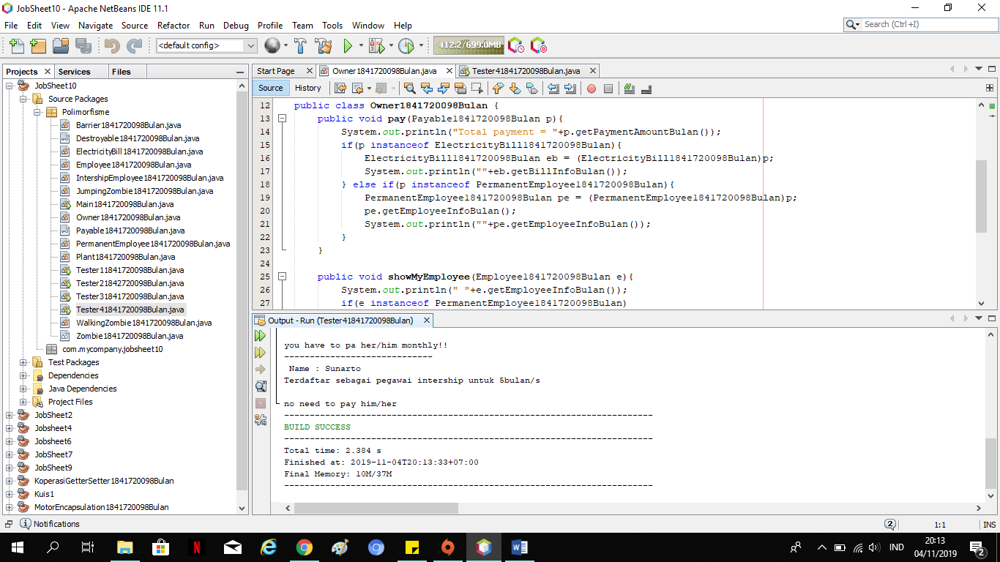
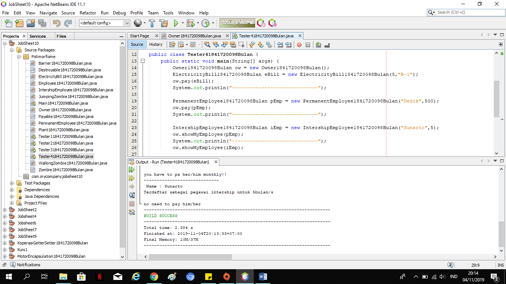
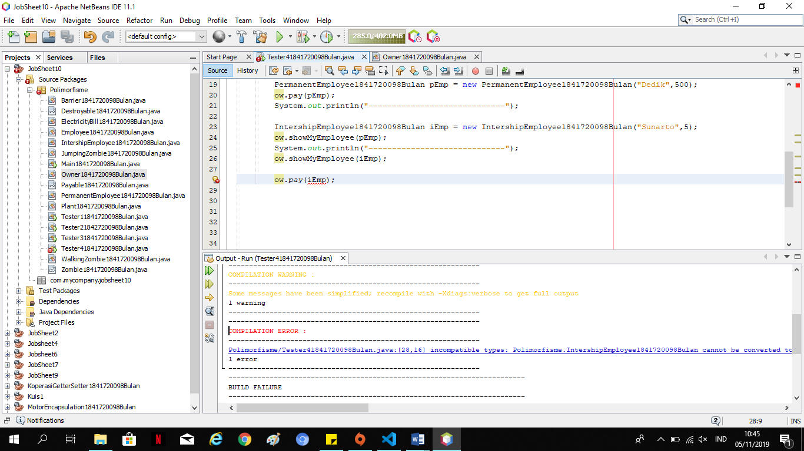
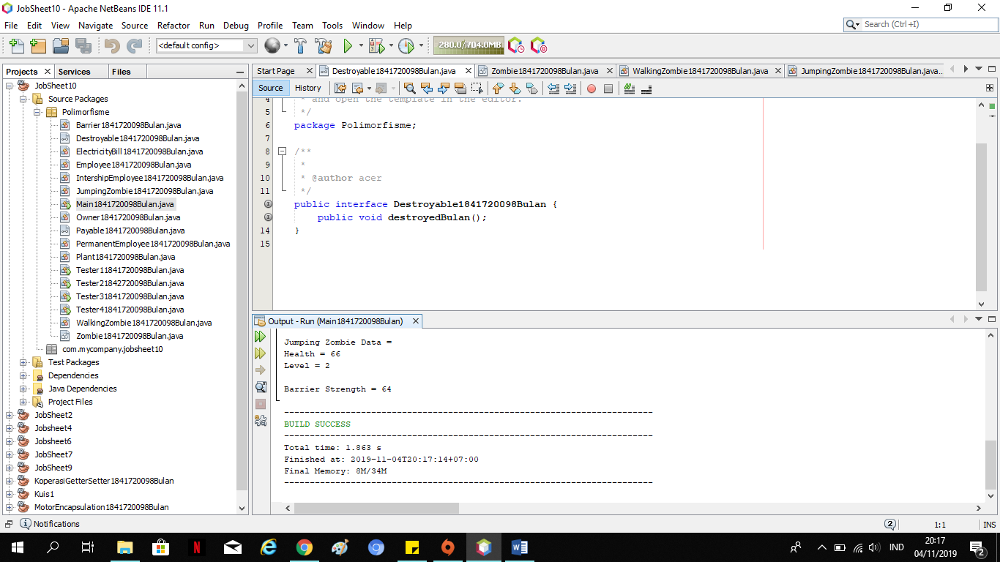
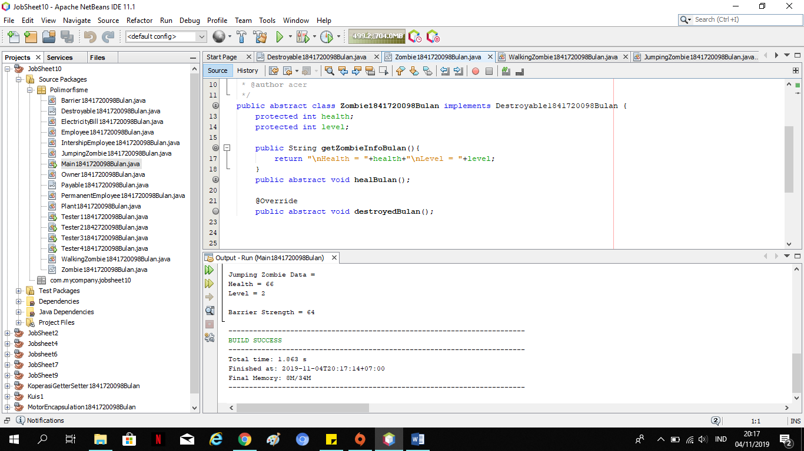
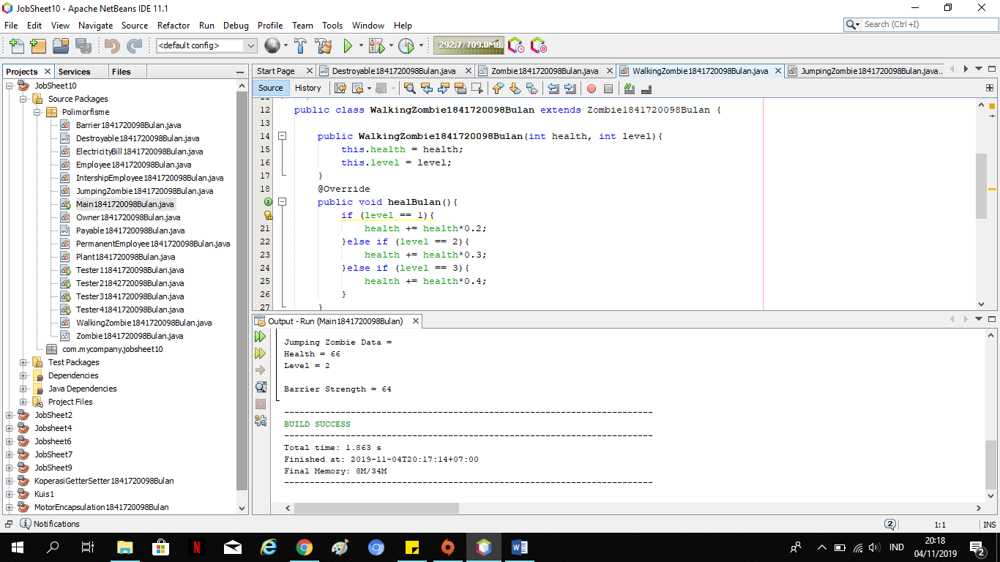
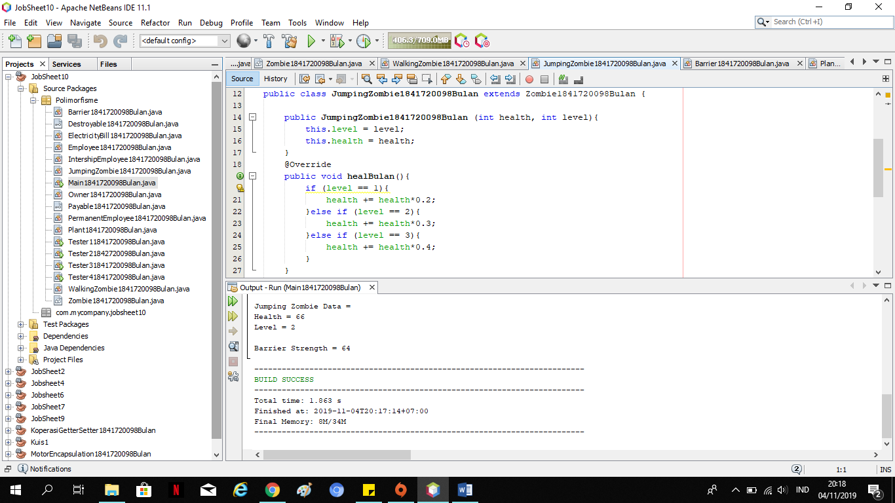
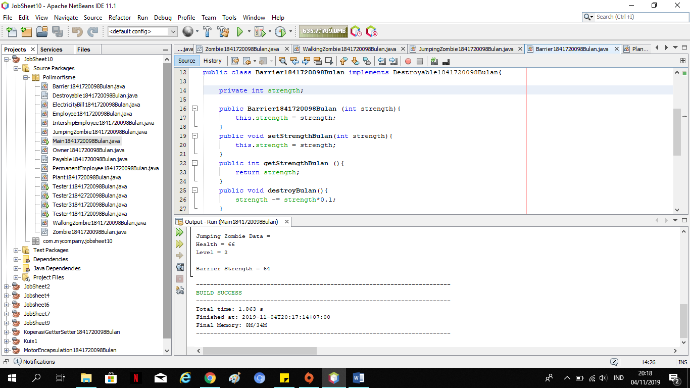
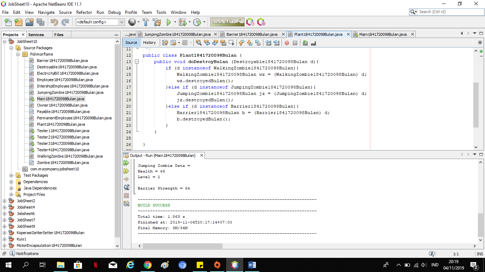
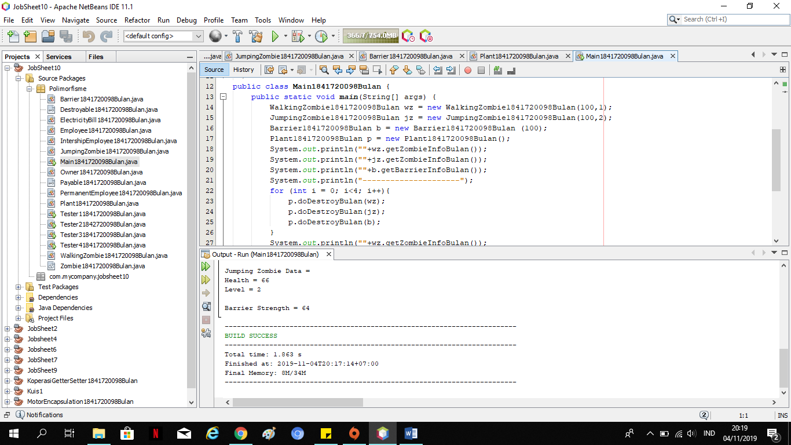

# Laporan Praktikum #10 - POLIMORFISME 

## Kompetensi

1. Memahami konsep dan bentuk dasar polimorfisme
2. Menerapkan polimorfisme pada parameter/argument method
3. Menerapkan object casting untuk meng-ubah bentuk objek

## Ringkasan Materi
Polimorfisme merupakan kemampuan suatu objek untuk memiliki banyak
bentuk. Penggunaan polimorfisme yang paling umum dalam OOP terjadi
ketika ada referensi super class yang digunakan untuk merujuk ke objek dari
sub class. Maka objek tersebut bisa diinstansiasi sebagai objek dari sub
class. 

Dari uraian tersebut bisa dilihat bahwa konsep polimorfisme bisa
diterapkan pada class-class yang memiliki relasi inheritance (relasi
generalisasi atau IS-A).
Selain pada class-class yang memiliki relasi inheritance, polimorfisme
juga bisa diterapkan pada interface. Ketika ada objek yang dideklarasikan dari
suatu interface, maka ia bisa digunakan untuk mereferensi ke objek dari
class-class yang implements ke interface tersebut.

## Percobaan

### Percobaan 1 -  Bentuk Dasar Polimorfisme

### Langkah Percobaan

Link Kode Program : 
[Employee1841720098Bulan](../../src/10_Polimorfisme/Employee1841720098Bulan.java)

Link Kode Program : 
[Payable1841720098Bulan](../../src/10_Polimorfisme/Payable1841720098Bulan.java)

Link Kode Program : 
[IntershipEmployee1841720098Bulan](../../src/10_Polimorfisme/IntershipEmployee1841720098Bulan.java)

Link Kode Program : 
[PermanentEmployee1841720098Bulan](../../src/10_Polimorfisme/PermanentEmployee1841720098Bulan.java)

Link Kode Program : 
[ElectricityBill1841720098Bulan](../../src/10_Polimorfisme/ElectricityBill1841720098Bulan.java)

Link Kode Program : 
[Tester 1 1841720098Bulan](../../src/10_Polimorfisme/Tester11841720098Bulan.java)

## Pertanyaan :  
1. Class apa sajakah yang merupakan turunan dari class Employee?

      Jawab : class  InternshipEmployee1841720098Bulan, class PermanentEmployee1841720098Bulan

2. Class apa sajakah yang implements ke interface Payable?

      Jawab : class ElectricityBill1841720098Bulan, class PermanentEmployee1841720098Bulan

3. Perhatikan class Tester1, baris ke-10 dan 11. Mengapa e, bisa diisi
dengan objek pEmp (merupakan objek dari class
PermanentEmployee) dan objek iEmp (merupakan objek dari class
InternshipEmploye) ?

      Jawab : karena pada baris sebelumnya sudah di beri penjelasan seperti gambar di bawah ini. Jadi e/Employee bisa memanggil keduanya.

      

4. Perhatikan class Tester1, baris ke-12 dan 13. Mengapa p, bisa diisi
dengan objek pEmp (merupakan objek dari class
PermanentEmployee) dan objek eBill (merupakan objek dari class
ElectricityBill) ?

      Jawab : karena pada baris sebelumnya sudah di beri penjelasan seperti gambar di bawah ini. Jadi p/Payable bisa memanggil keduanya.

      

5. Coba tambahkan sintaks:
p = iEmp;
e = eBill;
pada baris 14 dan 15 (baris terakhir dalam method main) ! Apa yang
menyebabkan error?

      Jawab :karena Class PermanentEmployee1841720098Bulan dan InternshipEmployee1841720098Bulan merupakan turunan dari Class Payable1841720098Bulan.

6. Ambil kesimpulan tentang konsep/bentuk dasar polimorfisme!

      Jawab : polimorfisme bisa diterapkan pada class-class yang memiliki relasi inheritance dan interface. Ketika ada objek yang dideklarasikan dari suatu interface, maka ia bisa digunakan untuk mereferensikan ke objek yang mengimplements class interface tersebut

### Percobaan 2 - Virtual method invocation 

Link Kode Program : 
[Tester 2 1841720098Bulan](../../src/10_Polimorfisme/Tester21841720098Bulan.java)

 #### Pertanyaan :  
 1. Perhatikan class Tester2 di atas, mengapa pemanggilan e.getEmployeeInfo() pada baris 8 dan pEmp.getEmployeeInfo() pada baris 10 menghasilkan hasil sama?  

      Jawab : karena sudah dideklarasikan bahwa object e merupakan pEmp.

2.	Mengapa pemanggilan method e.getEmployeeInfo() disebut sebagai pemanggilan method virtual (virtual method invication), sedangkan pEmp.getEmployeeInfo() tidak? 

      Jawab : karena e merupakan method yang fungsinya untuk passing

3.	Jadi apakah yang dimaksud dari virtual method invocation? Mengapa disebut virtual? 

      Jawab : Virtual method invocation terjadi ketika ada pemanggilan overriding method dari suatu objek polimorfisme. Disebut virtual karena antara method yang dikenali oleh compiler dan method yang dijalankan oleh JVM berbeda.  

### Percobaan 3 - Heterogenous Collection 

Link Kode Program : 
[Tester 3 1841720098Bulan](../../src/10_Polimorfisme/Tester31841720098Bulan.java)

#### Pertanyaan :
1. Perhatikan array e pada baris ke-8, mengapa ia bisa diisi dengan objek-objek dengan tipe yang berbeda, yaitu objek pEmp (objek dari 
PermanentEmployee)  dan  objek iEmp  (objek  dari 
InternshipEmployee)? 

      Jawab : karena objek pEmp dan iEmp merupakan object dari class yang merupakan turunan dari class Employee

2. Perhatikan juga baris ke-9, mengapa array p juga diisi dengan objek-objek dengan tipe yang berbeda, yaitu objek pEmp (objek dari PermanentEmployee) dan objek eBill (objek dari 
ElectricityBilling) ? 

      Jawab : objek pEmp dan eBill merupakan object dari class yang mengimplements dari class Payable.

3. Perhatikan baris ke-10, mengapa terjadi error? 

      Jawab : karena eBill bukan termasuk Class turunan dari Class Employee.

### Percobaan 3 - Argumen polimorfisme, instanceod dan casting objek 

Link Kode Program : 
[Owner1841720098Bulan](../../src/10_Polimorfisme/Owner1841720098Bulan.java)

Link Kode Program : 
[Tester 4 1841720098Bulan](../../src/10_Polimorfisme/Tester41841720098Bulan.java)

#### Pertanyaan :
1. Perhatikan class Tester4 baris ke-7 dan baris ke-11, mengapa pemanggilan ow.pay(eBill) dan ow.pay(pEmp) bisa dilakukan, padahal jika diperhatikan method pay() yang ada di dalam class Owner memiliki argument/parameter bertipe Payable? Jika diperhatikan lebih detil eBill merupakan objek dari ElectricityBill 	dan 	pEmp 	merupakan 	objek 	dari 
PermanentEmployee? 

      Jawab : karena keduanya sama - sama mengimplementasikan interface Payable.

2. Jadi apakah tujuan membuat argument bertipe Payable pada method pay() yang ada di dalam class Owner? 

      Jawab : untuk memanggil method getPaymentAmount yang ada di masing – masing object yang dimasukkan sebagai parameter.

3.	Coba pada baris terakhir method main() yang ada di dalam class 

      Jawab : Eror karena iEmp tidak mengimplements class Payable.

      

 
4.	Perhatikan class Owner, diperlukan untuk apakah sintaks p instanceof ElectricityBill pada baris ke-6 ?

      Jawab : mengecek apakah object yang dimasukkan sebagai implements dari Payable atau tidak.

5.	Perhatikan kembali class Owner baris ke-7, untuk apakah casting objek disana (ElectricityBill eb = (ElectricityBill) p) diperlukan ? Mengapa objek p yang bertipe Payable harus di-casting ke dalam objek eb yang bertipe ElectricityBill ? 

      Jawab : Untuk dikembalikan ke instan sesungguhnya sehingga dapat memanggil method getBillInfo() yang hanya ada di class ElectricityBill

## Tugas 

Link Kode Program : 
[Destroyable1841720098Bulan](../../src/10_Polimorfisme/Destroyable1841720098Bulan.java)

Link Kode Program : 
[Zombie1841720098Bulan](../../src/10_Polimorfisme/Zombie1841720098Bulan.java)

Link Kode Program : 
[WalkingZombie1841720098Bulan](../../src/10_Polimorfisme/WalkingZombie1841720098Bulan.java)

Link Kode Program : 
[JumpingZombie1841720098Bulan](../../src/10_Polimorfisme/JumpingZombie1841720098Bulan.java)

Link Kode Program : 
[Barrier1841720098Bulan](../../src/10_Polimorfisme/Barrier1841720098Bulan.java)

Link Kode Program : 
[Plant1841720098Bulan](../../src/10_Polimorfisme/Plant1841720098Bulan.java)

Link Kode Program : 
[Main1841720098Bulan](../../src/10_Polimorfisme/Main1841720098Bulan.java)

## Kesimpulan

dalam pratikum ini kita dapat memahami konsep dan bentuk dasar polimorfisme.
Polimorfisme merupakan kemampuan suatu objek untuk memiliki banyak
bentuk. Penggunaan polimorfisme yang paling umum dalam OOP terjadi
ketika ada referensi super class yang digunakan untuk merujuk ke objek dari
sub class. Maka objek tersebut bisa diinstansiasi sebagai objek dari sub
class. 

## Pernyataan Diri

Saya menyatakan isi tugas, kode program, dan laporan praktikum ini dibuat oleh saya sendiri. Saya tidak melakukan plagiasi, kecurangan, menyalin/menggandakan milik orang lain.

Jika saya melakukan plagiasi, kecurangan, atau melanggar hak kekayaan intelektual, saya siap untuk mendapat sanksi atau hukuman sesuai peraturan perundang-undangan yang berlaku.

Ttd,

***(Defika Bulan Rahmaningrum)***
