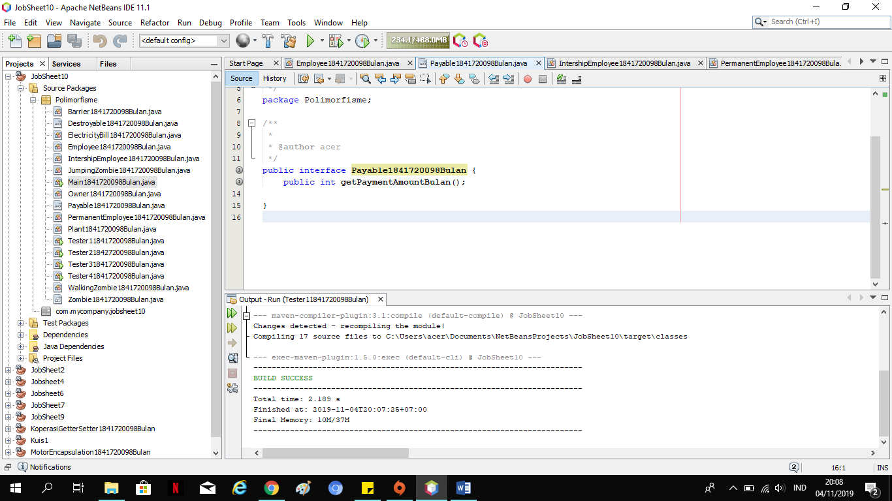

# Laporan Praktikum #9 - POLIMORFISME 

## Kompetensi

1. Memahami konsep dan bentuk dasar polimorfisme
2. Menerapkan polimorfisme pada parameter/argument method
3. Menerapkan object casting untuk meng-ubah bentuk objek

## Ringkasan Materi
Polimorfisme merupakan kemampuan suatu objek untuk memiliki banyak
bentuk. Penggunaan polimorfisme yang paling umum dalam OOP terjadi
ketika ada referensi super class yang digunakan untuk merujuk ke objek dari
sub class. Maka objek tersebut bisa diinstansiasi sebagai objek dari sub
class. 

Dari uraian tersebut bisa dilihat bahwa konsep polimorfisme bisa
diterapkan pada class-class yang memiliki relasi inheritance (relasi
generalisasi atau IS-A).
Selain pada class-class yang memiliki relasi inheritance, polimorfisme
juga bisa diterapkan pada interface. Ketika ada objek yang dideklarasikan dari
suatu interface, maka ia bisa digunakan untuk mereferensi ke objek dari
class-class yang implements ke interface tersebut.

## Percobaan

### Percobaan 1 -  Bentuk Dasar Polimorfisme

### Langkah Percobaan

Link Kode Program : 
[Employee1841720098Bulan](../../src/10_Polimorfisme/Employee1841720098Bulan.java)

Link Kode Program : 
[Payable1841720098Bulan](../../src/10_Polimorfisme/Payable1841720098Bulan.java)

Link Kode Program : 
[IntershipEmployee1841720098Bulan](../../src/10_Polimorfisme/IntershipEmployee1841720098Bulan.java)

Link Kode Program : 
[PermanentEmployee1841720098Bulan](../../src/10_Polimorfisme/PermanentEmployee1841720098Bulan.java)

Link Kode Program : 
[ElectricityBill1841720098Bulan](../../src/10_Polimorfisme/ElectricityBill1841720098Bulan.java)

Link Kode Program : 
[Tester11841720098Bulan](../../src/10_Polimorfisme/Tester11841720098Bulan.java)

## Pertanyaan :  
1. Class apa sajakah yang merupakan turunan dari class Employee?

      Jawab : class  InternshipEmployee1841720098Bulan, class PermanentEmployee1841720098Bulan

2. Class apa sajakah yang implements ke interface Payable?

      Jawab : class ElectricityBill1841720098Bulan, class PermanentEmployee1841720098Bulan

3. Perhatikan class Tester1, baris ke-10 dan 11. Mengapa e, bisa diisi
dengan objek pEmp (merupakan objek dari class
PermanentEmployee) dan objek iEmp (merupakan objek dari class
InternshipEmploye) ?

      Jawab : karena pada baris sebelumnya sudah di beri penjelasan seperti gambar di bawah ini. Jadi e/Employee bisa memanggil keduanya.

      

4. Perhatikan class Tester1, baris ke-12 dan 13. Mengapa p, bisa diisi
dengan objek pEmp (merupakan objek dari class
PermanentEmployee) dan objek eBill (merupakan objek dari class
ElectricityBill) ?

      Jawab : karena pada baris sebelumnya sudah di beri penjelasan seperti gambar di bawah ini. Jadi p/Payable bisa memanggil keduanya.

      

5. Coba tambahkan sintaks:
p = iEmp;
 e = eBill;
pada baris 14 dan 15 (baris terakhir dalam method main) ! Apa yang
menyebabkan error?

      Jawab :karena Class PermanentEmployee1841720098Bulan dan InternshipEmployee1841720098Bulan merupakan turunan dari Class Payable1841720098Bulan.

6. Ambil kesimpulan tentang konsep/bentuk dasar polimorfisme!

      Jawab : polimorfisme bisa diterapkan pada class-class yang memiliki relasi inheritance dan interface. Ketika ada objek yang dideklarasikan dari suatu interface, maka ia bisa digunakan untuk mereferensikan ke objek yang mengimplements class interface tersebut

### Percobaan 2 - Interface 

Link Kode Program : 
[ICumlaude1841720098Bulan](../../src/9_Abstract_Class_dan_Interface/interfacelatihan/ICumlaude1841720098Bulan.java)

Link Kode Program : 
[Mahasiswa1841720098Bulan](../../src/9_Abstract_Class_dan_Interface/interfacelatihan/Mahasiswa1841720098Bulan.java)

Link Kode Program : 
[Sarjana1841720098Bulan](../../src/9_Abstract_Class_dan_Interface/interfacelatihan/Sarjana1841720098Bulan.java)

Link Kode Program : 
[PascaSarjana1841720098Bulan](../../src/9_Abstract_Class_dan_Interface/interfacelatihan/PascaSarjana1841720098Bulan.java)

Link Kode Program : 
[Rektor1841720098Bulan](../../src/9_Abstract_Class_dan_Interface/interfacelatihan/Rektor1841720098Bulan.java)

Link Kode Program : 
[Program1841720098Bulan](../../src/9_Abstract_Class_dan_Interface/interfacelatihan/Program1841720098Bulan.java)

 #### Pertanyaan diskusi:  
 -  Mengapa pada langkah nomor 9 terjadi error? Jelaskan! 
        
       Jawab : Karena Class mahasiswa tidak mengimplements kan class ICumlaude. Sehingga saat di panggil terjadi error 

 -  Dapatkah method kuliahDiKampus() dipanggil dari objek sarjanaCumlaude di class Program? Mengapa demikian?
        
       Jawab : Bisa , karena pada class Sarjana sudah di instansiasi menjadi object sajanaCumlaude di class Program. Dan class Sarjana sudah ter-extends dengan class Mahasiswa 

 -  Dapatkah method kuliahDiKampus() dipanggil dari parameter mahasiswa di method beriSertifikatCumlaude() pada class Rektor? Mengapa demikian? 

       Jawab : Tidak, Karena Tidak Ada abstract method pada interface ICumlaude 

 - Modifikasilah method beriSertifikatCumlaude() pada class Rektor agar hasil eksekusi class Program menjadi seperti berikut ini: 

Jawab : 

### Percobaan 3 - Multiple Interfaces Implementation 

Link Kode Program : 
[IBerprestasi1841720098Bulan](../../src/9_Abstract_Class_dan_Interface/interfacelatihan/IBerprestasi1841720098Bulan.java)

Link Kode Program : 
[PascaSarjana1841720098Bulan](../../src/9_Abstract_Class_dan_Interface/interfacelatihan/PascaSarjana1841720098Bulan.java)

Link Kode Program : 
[Rektor1841720098Bulan](../../src/9_Abstract_Class_dan_Interface/interfacelatihan/Rektor1841720098Bulan.java)

Link Kode Program : 
[Program1841720098Bulan](../../src/9_Abstract_Class_dan_Interface/interfacelatihan/Program1841720098Bulan.java)

 #### Pertanyaan diskusi:
 Apabila Sarjana Berprestasi harus menjuarai kompetisi NASIONAL dan menerbitkan artikel di jurnal NASIONAL, maka modifikasilah class-class yang terkait pada aplikasi Anda agar di class Program objek pakRektor dapat memberikan sertifikat mawapres pada objek sarjanaCumlaude. 

 Jawab : 
 

## Kesimpulan

dalam pratikum ini kita dapat mengenal dan memahami konsep dari Abstract Class dan Interface 

## Pernyataan Diri

Saya menyatakan isi tugas, kode program, dan laporan praktikum ini dibuat oleh saya sendiri. Saya tidak melakukan plagiasi, kecurangan, menyalin/menggandakan milik orang lain.

Jika saya melakukan plagiasi, kecurangan, atau melanggar hak kekayaan intelektual, saya siap untuk mendapat sanksi atau hukuman sesuai peraturan perundang-undangan yang berlaku.

Ttd,

***(Defika Bulan Rahmaningrum)***
