# Laporan Praktikum #11 - GUI 

## Kompetensi

1. Membuat aplikasi Graphical User Interface sederhana dengan bahasa pemrograman java;
2. Mengenal komponen GUI seperti frame, label, textfield, combobox, radiobutton, checkbox,
textarea, menu, serta table;
3. Menambahkan event handling pada aplikasi GUI.

## Ringkasan Materi
Pada bab-bab sebelumnya interaksi antara user dengan program hanya berbasis console editor dengan
tampilan dos yang membosankan, maka agar interaksi antara user dengan program tidak
membosankan diperlukanlah sebuah interface yang menghubungkan antara user dengan program
dengan tampilan grafis, interface ini dinamakan dengan GUI(Graphical User Interface). Dalam
pemrograman GUI terdapat beberapa bagian yang harus dilakukan yaitu:
1. Membuat windows utama
2. Menentukan komponen-komponen pendukung program
3. Menentukan tata letak layout agar nantinya semua komponen – komponen yang sudah
dipersiapkan bisa diaatur sedemikian rupa
4. Event Handling dari sebuah aktivitas, seperti penekanan button, check box dan lain-lain
Java Swing merupakan bagian dari JFC (Java Foundation Classes) yang menyediakan API untuk
menangani hal yang berkaitan dengan GUI bagi program Java. Kita bisa membedakan komponen
Swing dengan komponen AWT, di mana pada umumnya kelas-kelas yang berada dalam komponen
Swing diawali dengan huruf J, misal: JButton, JLabel, JTextField, JRadioButton.

## Percobaan

### Percobaan 1 -   JFrame HelloGUI
### Langkah Percobaan
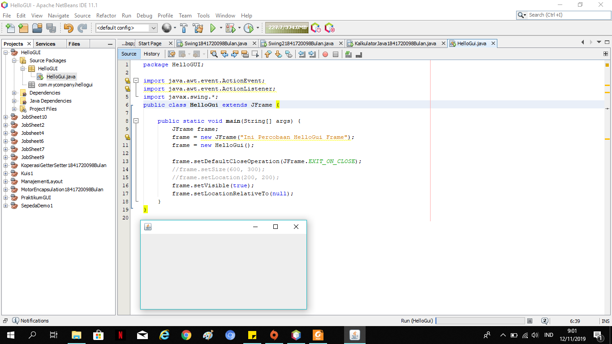

Link Kode Program : 
[HelloGUI1841720098Bulan](../../src/11_GUI/HelloGUI1841720098Bulan.java)

### Percobaan 2 -   Menangani Input Pada GUI

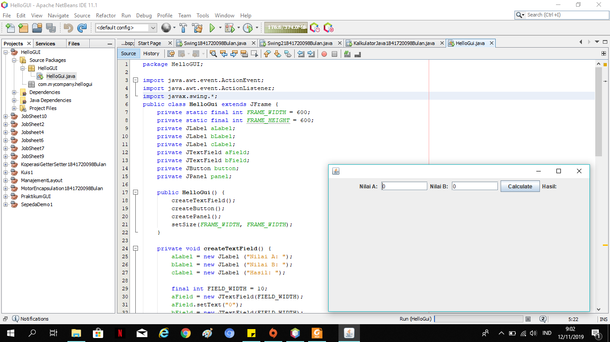

Link Kode Program : 
[HelloGUI1841720098Bulan](../../src/11_GUI/HelloGUI1841720098Bulan.java)

### Pertanyaan
1. Modifikasi kode program dengan menambahkan JButton baru untuk melakukan fungsi
perhitungan penambahan, sehingga ketika button di klik (event click) maka akan
menampilkan hasil penambahan dari nilai A dan B

      Jawab : 

### Percobaan 3 -   Manajemen Layout

### Langkah Percobaan
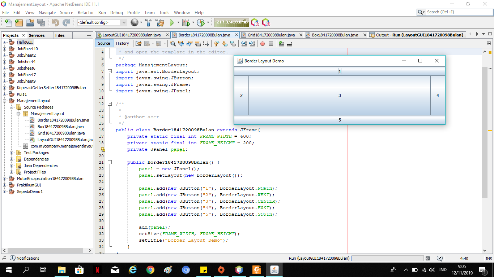

Link Kode Program : 
[Border1841720098Bulan](../../src/11_GUI/Border1841720098Bulan.java)

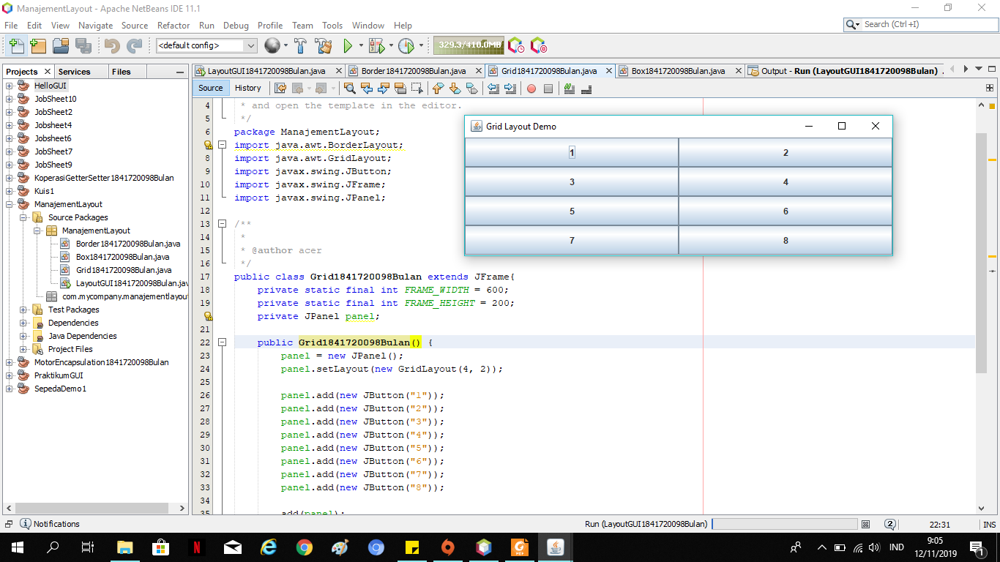

Link Kode Program : 
[Grid1841720098Bulan](../../src/11_GUI/Grid1841720098Bulan.java)

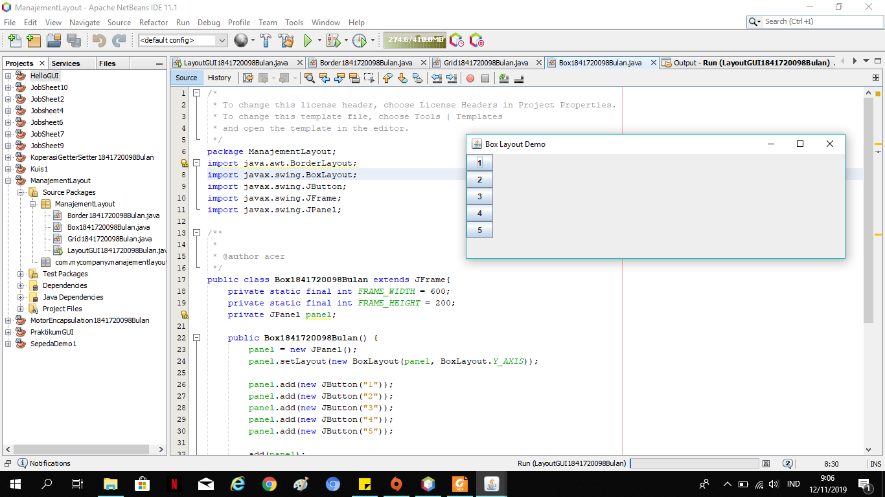

Link Kode Program : 
[Box1841720098Bulan](../../src/11_GUI/Box1841720098Bulan.java)

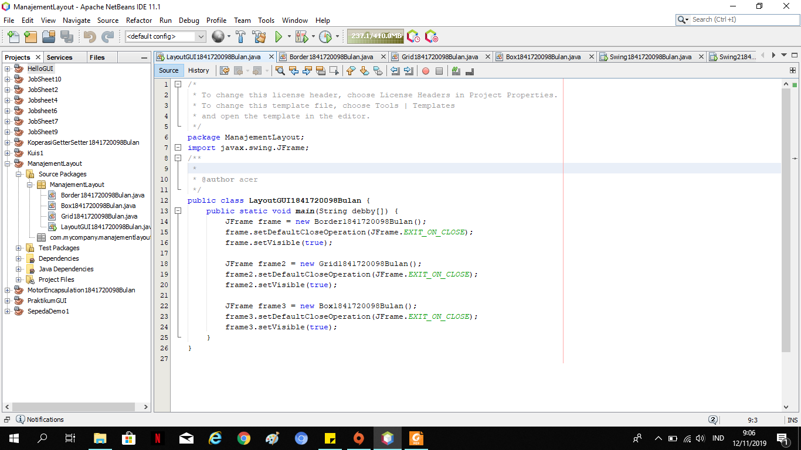
Link Kode Program : 
[LayoutGUI1841720098Bulan](../../src/11_GUI/LayoutGUI1841720098Bulan.java)

## Pertanyaan :  
1. Apa perbedaan dari Grid Layout, Box Layout dan Border Layout?

      Jawab :
      - Grid menampilkan angka-nya menggunakan tata letak kanan dan kiri 
      - Border menampilkan angkanya sesuai dengan table border yang telah dibuat dan telah diatur 
      - BOX menampilkan angkanya terdapat pada box nya masing masing dan menampilkan angkanya horizontal atau kebawah

2. Apakah fungsi dari masing-masing kode berikut?
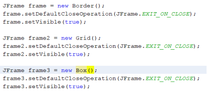

      Jawab : menampilkan setiap outputnya dari source code Border, Grid, Box

### Percobaan 4 -   Membuat GUI Melalui IDE Netbeans

### Langkah Percobaan
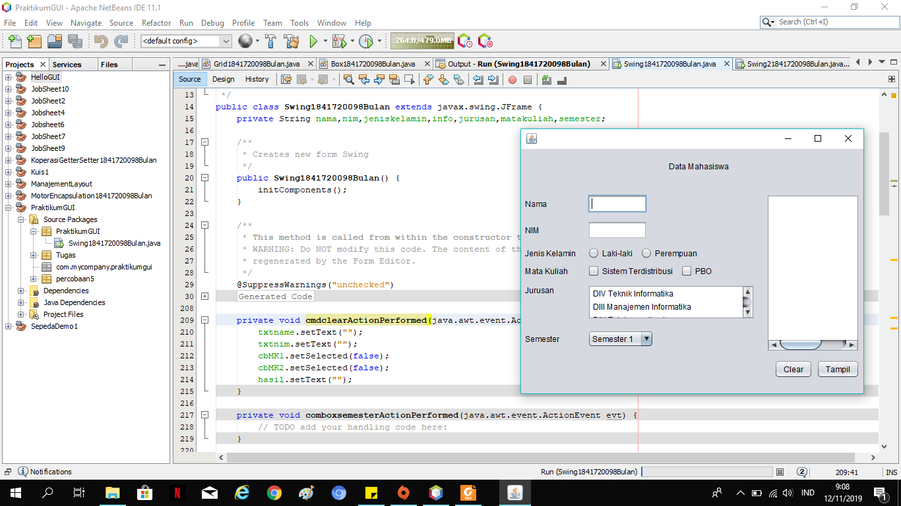

Link Kode Program : 
[Swing 1841720098Bulan](../../src/11_GUI/Swing1841720098Bulan.java)

## Pertanyaan :
1. Apakah fungsi dari kode berikut?
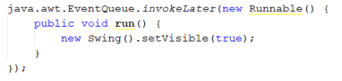

      Jawab : menampilkan dari JFrame form

2. Mengapa pada bagian logika checkbox dan radio button digunakan multiple if ?

      Jawab : Digunakan untuk pengecekkan pada checkbox dicentang atau tidaknya 

3. Lakukan modifikasi pada program untuk melakukan menambahkan inputan berupa alamat dan berikan fungsi pemeriksaan pada nilai Alamat tersebut jika belum diisi dengan
menampilkan pesan peringatan

### Percobaan 5 -   JTabPane, JTtree, JTable

### Langkah Percobaan

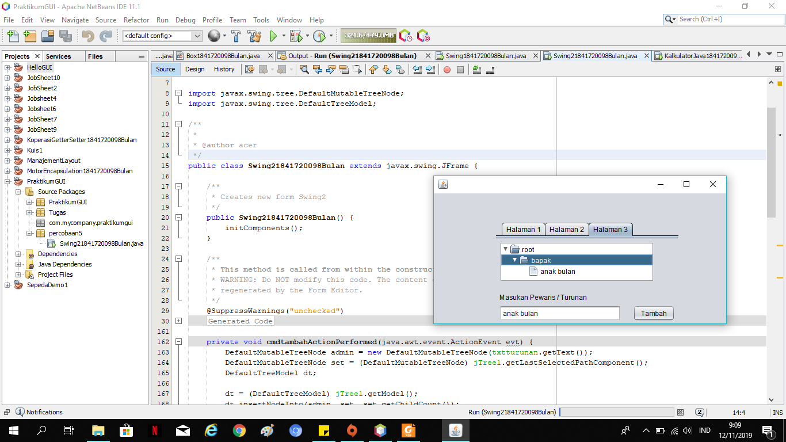

Link Kode Program : 
[Swing 2 1841720098Bulan](../../src/11_GUI/Swing21841720098Bulan.java)

## Pertanyaan :
1.  Apa kegunaan komponen swing JTabPane, JTtree, pada percobaan 5?

      Jawab : 
      - JTabPane : digunakan untuk tampilan atau background nya untuk mengisi pada setiap halaman, 
      - JTree digunakan untuk menyimpan pada tambah jika button tambahnya digunakan

2. Modifikasi program untuk menambahkan komponen JTable pada tab Halaman 1 dan tab
Halaman 2

## Tugas 

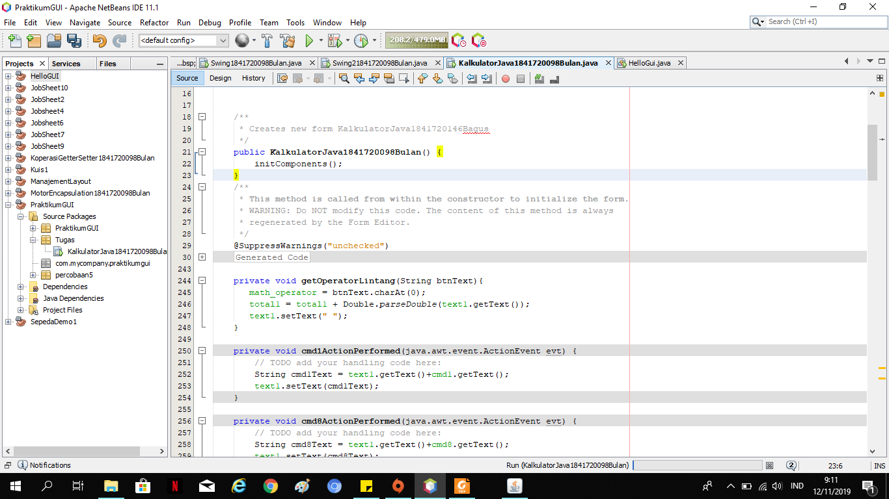

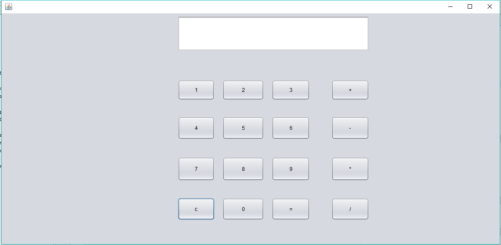

Link Kode Program : 
[Kalkulator1841720098Bulan](../../src/11_GUI/Kalkulator1841720098Bulan.java)

## Kesimpulan

dalam pratikum ini kita dapat membuat aplikasi Graphical User Interface sederhana dengan bahasa pemrograman java lalu
mengenal komponen GUI seperti frame, label, textfield, combobox, radiobutton, checkbox,
textarea, menu, serta table dan menambahkan event handling pada aplikasi GUI.

## Pernyataan Diri

Saya menyatakan isi tugas, kode program, dan laporan praktikum ini dibuat oleh saya sendiri. Saya tidak melakukan plagiasi, kecurangan, menyalin/menggandakan milik orang lain.

Jika saya melakukan plagiasi, kecurangan, atau melanggar hak kekayaan intelektual, saya siap untuk mendapat sanksi atau hukuman sesuai peraturan perundang-undangan yang berlaku.

Ttd,

***(Defika Bulan Rahmaningrum)***
