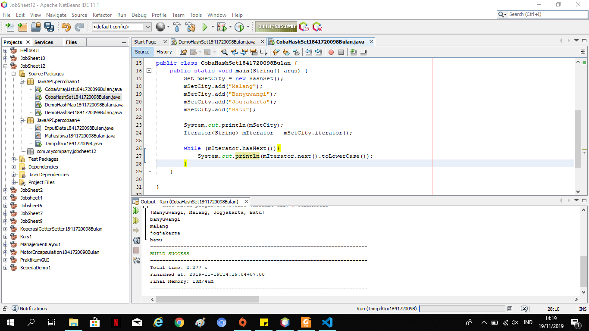
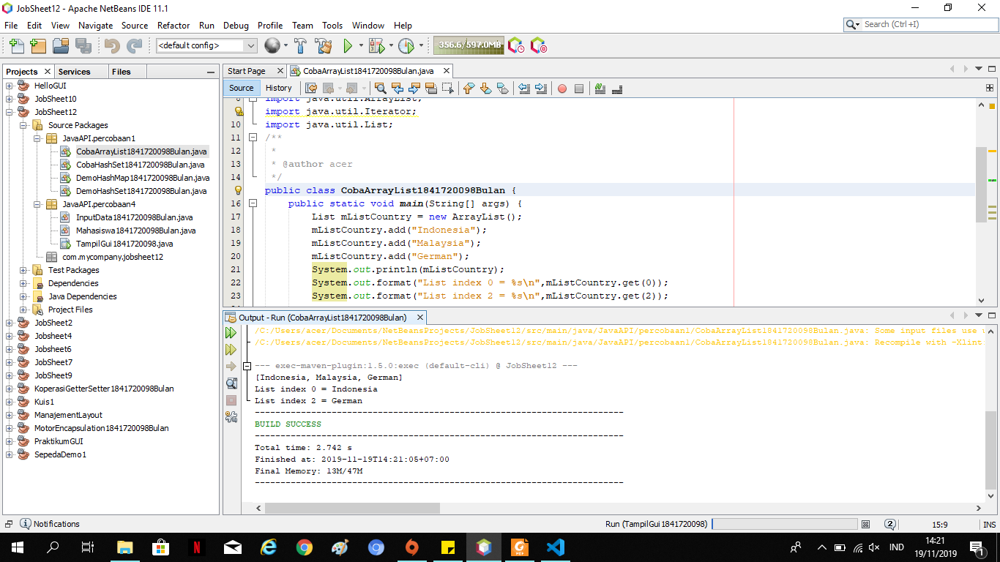
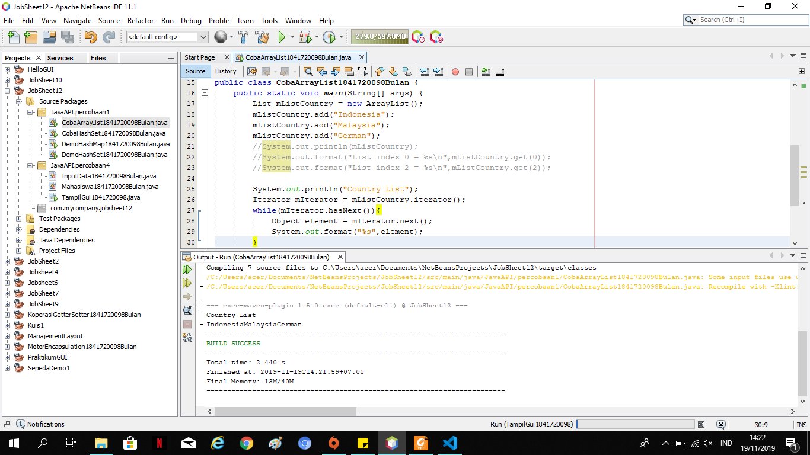
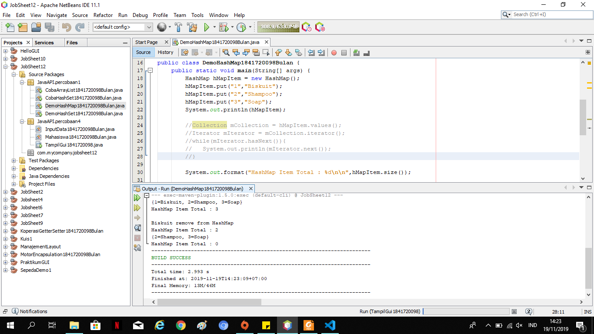
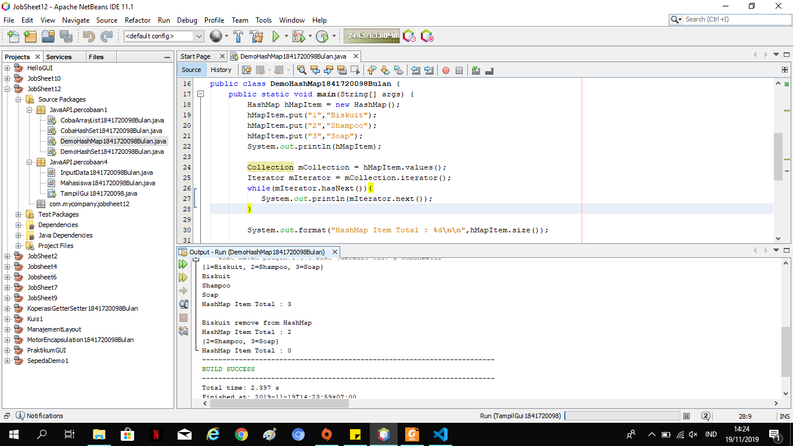
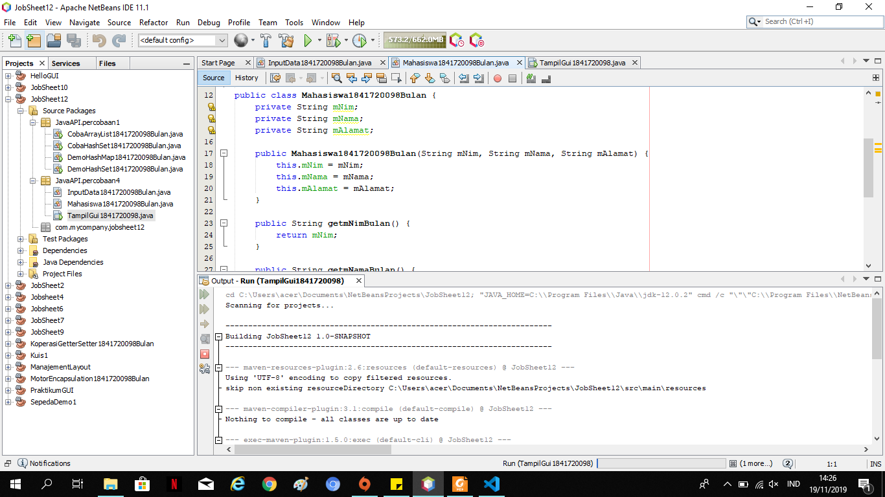
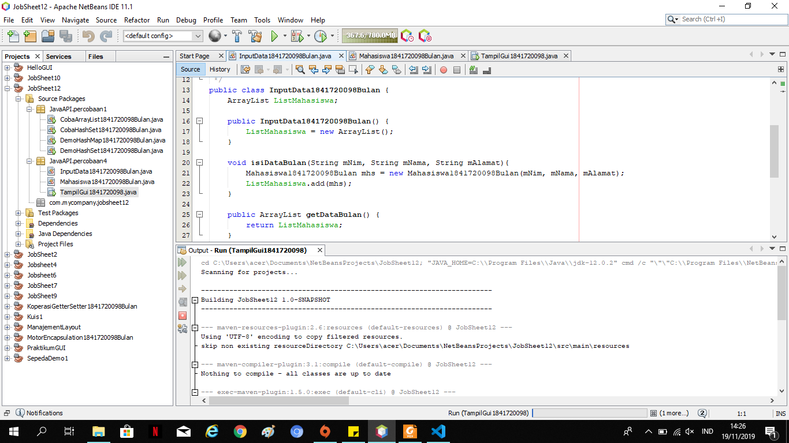
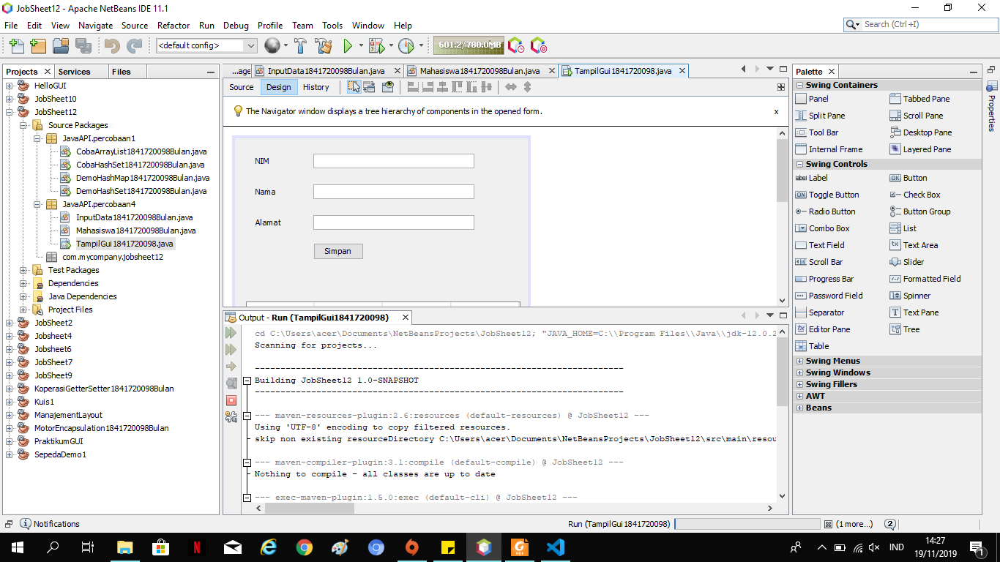

# Laporan Praktikum #12 - Java_API 

## Kompetensi

1. Memahami cara penyimpanan objek menggunakan Collection dan Map.
2. Mengetahui pengelompokan dari Collection.
3. Mengetahui perbedaan dari interface Set, List dan Map.

## Ringkasan Materi
Collection adalah suatu objek yang bisa digunakan untuk menyimpan sekumpulan objek.
Objek yang ada dalam Collection disebut elemen. Collection menyimpan elemen yang bertipe
Object, sehingga berbagai tipe object bisa disimpan dalam Collection. Class-class mengenai
Collection tergabung dalam Java Collection Framework. Class-class Collection diletakkan
dalam package java.util dan mempunyai dua interface utama yaitu Collection

## Percobaan

### Percobaan 1 -   Set
### Langkah Percobaan

Link Kode Program : 
[CobaHashSet 1841720098Bulan](../../src/12_Java_API/CobaHashSet1841720098Bulan.java)

### Pertanyaan
1. Apakah fungsi import java.util.*; pada program diatas!

      Jawab : Untuk mengimport semua class di dalam java

2. Pada baris program keberapakah yang berfungsi untuk menciptakan object HashSet?

      Jawab : baris ke-17

3. Apakah fungsi potongan program dibawah ini pada percobaan 1!

      Jawab : Untuk menambahkan object kedalam HashSet()

4. Tambahkan set.add(“Malang”); kemudian jalankan program! Amati hasilnya dan jelaskan
mengapa terjadi error!

      Jawab : Karena nama object yang seharusnya adalah mSetCity. Jika menggunakan set maka program tidak mengenali object tersebut 

5. Jelaskan fungsi potongan program dibawah ini pada percobaan1 

      Jawab : Iterator digunakan untuk mengakses dan menampilkan nilai beserta tambahan method lain yang didefinisikan didalam interface iterator 

### Percobaan 2 -   List

Link Kode Program : 
[CobaArrayList 1841720098Bulan](../../src/12_Java_API/CobaArrayList1841720098Bulan.java)

### Pertanyaan
1. Apakah fungsi potongan program dibawah ini!

      Jawab :  Untuk menampilkan nilai dari mListCountry dan menampilkan data mListCountry index ke 0 dan 2

2. Ganti potongan program pada soal no 1 menjadi sebagai berikut
Kemudian jalankan program tersebut!

      Jawab : 

3. Jelaskan perbedaan menampilkan data pada ArrayList menggunakan potongan program pada
soal no 1 dan no 2!

      Jawab : Ketika menggunakan potongan program no 1 maka menampilkan data menggunakan list, sedangkan pada potongan program no 2 menampilkan semua data dengan iterator 

### Percobaan 3 -   Map

### Langkah Percobaan

Link Kode Program : 
[DemoHashMap 1841720098Bulan](../../src/12_Java_API/DemoHashMap1841720098Bulan.java)

## Pertanyaan :  
1. Jelaskan fungsi hMapItem.put("1","Biskuit") pada program!

      Jawab : Untuk menambahkan object dengan key 1 dengan nama biscuit kedalam object

2. Jelaskan fungsi hMapItem.size() pada program!

      Jawab : untuk menampilkan size atau banyak data dari hMapItem

3. Jelaskan fungsi hMapItem.remove("1") pada program!

      Jawab : untuk menghapus item dengan key 1

4. Jelaskan fungsi hMapItem.clear() pada program!

      Jawab : untuk menghapus semua data yang ada pada hMapItem

5. Tambahkan kode program yang di blok pada program yang sudah anda buat!

      Jawab : 

6. Jalankan program dan amati apa yang terjadi!7. Apakah perbedaan program sebelumnya dan setelah ditambahkan kode program pada soal no
5 diatas? Jelaskan!

      Jawab :
 

### Percobaan 4 -   Implementasi ArrayList dalam GUI

### Langkah Percobaan

Link Kode Program : 
[Mahasiswa 1841720098Bulan](../../src/12_Java_API/Mahasiswa1841720098Bulan.java)

Link Kode Program : 
[InputData 1841720098Bulan](../../src/12_Java_API/InputData1841720098Bulan.java)

Link Kode Program : 
[TampilGUI 1841720098Bulan](../../src/12_Java_API/TampilGui1841720098Bulan.java)

### Pertanyaan :

## Kesimpulan

dalam pratikum ini kita dapat Memahami cara penyimpanan objek menggunakan Collection dan Map,pengelompokan dari Collection, dan Mengetahui perbedaan dari interface Set, List dan Map.

## Pernyataan Diri

Saya menyatakan isi tugas, kode program, dan laporan praktikum ini dibuat oleh saya sendiri. Saya tidak melakukan plagiasi, kecurangan, menyalin/menggandakan milik orang lain.

Jika saya melakukan plagiasi, kecurangan, atau melanggar hak kekayaan intelektual, saya siap untuk mendapat sanksi atau hukuman sesuai peraturan perundang-undangan yang berlaku.

Ttd,

***(Defika Bulan Rahmaningrum)***
