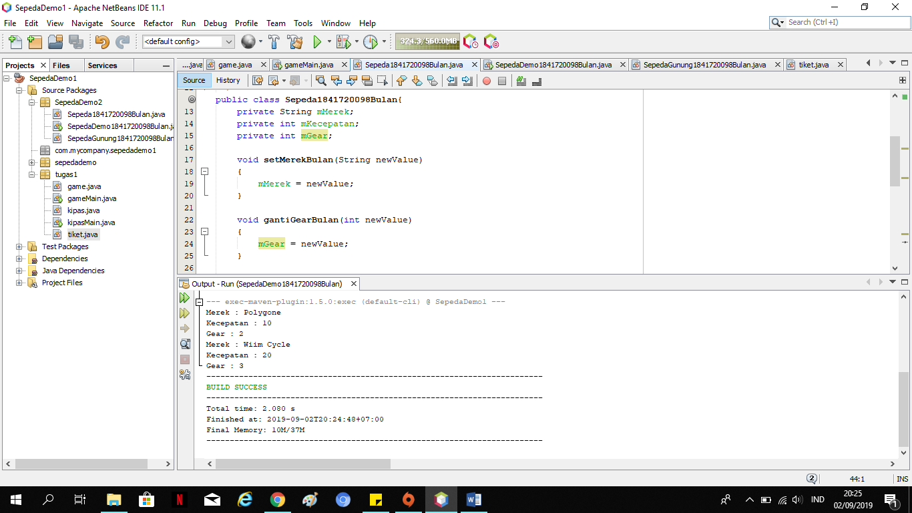
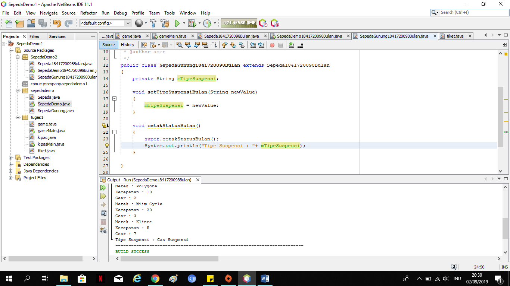

# Laporan Praktikum #1 - Pengantar Konsep PBO

## Kompetensi

1.Konsep Dasar PBO

2.Perbedaan Pemrograman Berorientasi Objek dan Pemrograman Struktural

## Ringkasan Materi

Object-Oriented Programming adalah pemrograman  yang berorientasi kepada objek. Tujuan dari OOP diciptakan adalah untuk mempermudah pengembangan program dengan cara mengikuti model yang telah ada di kehidupan sehari-hari.

PBO memudahkan user ketika melakukan pemrograman yang memiliki banyak relasi.

## Percobaan

### Percobaan 1

(pada percobaan ini, kita mendemonstrasikan bagaimana membuat class, membuat object, kemudian mengakses method didalam class tersebut)

`contoh screenshot yang benar, menampilkan 3 komponen, yaitu struktur project, kode program, dan hasil kompilasi`

Link Kode Program : [Sepeda1841720098Bulan](../../src/1_Pengantar_Konsep_PBO/Sepeda1841720098Bulan.java)

Link Kode Program : [SepedaDemo1841720098Bulan](../../src/1_Pengantar_Konsep_PBO/SepedaDemo1841720098Bulan.java)

### Percobaan 2

(Pada percobaan 2 kita mendemonstrasikan salah satu fitur yang paling penting dalam PBO, yaitu inheritance. Disini kita akan membuat class SepedaGunung yang mana adalah turunan/warisan dari class Sepeda. Pada dasarnya class SepedaGunung adalah sama dengan class Sepeda, hanya saja pada sepeda gunung terdapat tipe suspensi. Untuk itu kita tidak perlu membuat class Sepeda Gunung dari nol, tapi kita wariskan saja class Sepeda ke class SepedaGunung. )

`contoh screenshot yang benar, menampilkan 3 komponen, yaitu struktur project, kode program, dan hasil kompilasi`

Link Kode Program : [SepedaGunung1841720098Bulan](../../src/1_Pengantar_Konsep_PBO/SepedaGunung1841720098Bulan.java)

Link Kode Program : [SepedaDemo1841720098Bulan](../../src/1_Pengantar_Konsep_PBO/SepedaDemo1841720098Bulan.java)

## Pertanyaan

Soal!!
1. Sebutkan dan jelaskan aspek-aspek yang ada pada pemrograman berorientasi objek!
2. Apa yang dimaksud dengan object dan apa bedanya dengan class?
3. Sebutkan salah satu kelebihan utama dari pemrograman berorientasi objek dibandingkan dengan pemrograman struktural!
4. Pada class Sepeda, terdapat state/atribut apa saja?
5. Tambahkan atribut warna pada class Sepeda.
6. Mengapa pada saat kita membuat class SepedaGunung, kita tidak perlu membuat class nya dari nol?

Jawaban!!
1. Aspek yang terdapat didalam PBO : 
 - Class adalah blueprint dari objek. Ambil contoh objek Mobil. Terdapat berbagai macam mobil di dunia, dari berbagai merk dan model.      Namun semua Mobil dibangun berdasarkan blueprint yang sama, sehingga tiap mobil memiliki komponen dan karakteristik yang sama.      
 - Object adalah suatu rangkaian dalam program yang terdiri dari state dan behaviour. Object pada software dimodelkan sedemikian rupa      sehingga mirip dengan objek yang ada di dunia nyata. Objek memiliki state dan behaviour. State adalah ciri-ciri atau atribut dari        objek tersebut. behaviour adalah perilaku yang dapat dilakukan objek tersebut. 
 - Enkapsulasi adalah menggabungkan variabel dan fungsi anggota bersama dan menjalankan nya pada objek. Encapsulation menyembunyikan        informasi detail dari suatu class
 - Inheritance adalah mekanisme untuk mengeliminasi kode. Alih-alih mendefinisikan ulang semua properti dan metode pada setiap elemen,      metode dan properti yang ada dapat di tempatkan pada objek yang umum dan objek lainnya dapat mewarisi properti dan metode yang ada      sehingga inheritance membantu untuk mengeliminasi kode yang tidak di perlukan
 - Abstraksi adalah salah satu fitur dari pemrograman berorientasi objek. Abstraksi berarti hanya menampilkan informasi penting dan        menyembunyikan detailnya. Abstraksi data mengacu pada penyediaan hanya informasi penting tentang data bagian luar, menyembunyikan        detail latar belakang atau implementasi.
 -Polymorphism sering dikaitkan dengan penggunaan lebih dari satu metoda dengan nama sama. Penggunaan metoda dengan nama sama dapat       diterapkan dengan method overloading dan method overriding. Peran polymorphism sebenarnya tidak terbatas hanya pada hal tersebut. Ada   keterkaitan antara polymorphism dan inheritance (turunan).
 
2. Objek adalah suatu rangkaian dalam program yang terdiri dari state dan behavior. 
   Perbedaannya : objek merupakan hasil instansiasi dari suatu kelas, sedangkan kelas bisa digunakan untuk menciptakan banyak objek. 

3. OOP menyediakan struktur modular yang jelas untuk program sehingga OOP sanat bagus digunakan untuk mendefinisikan tipe data abstrak      di mana detail implementasinya tersembunyi.
   OOP mempermudah dalam maintenance, memodifikasi bahkan membuat sebuah objek yang baru tanpa mengubah kode yang sudah ada.
   OOP menyediakan framework untuk library code dimana komponen software yang tersedia dapat dengan mudah di adaptasi dan di modifikasi    oleh programmer. Hal ini sangat berguna untuk mengembangkan GUI ( Graphical User Interface ) dan UX ( User Xperience ).
   sumber : https://magneticinfo.blogspot.com/2014/08/apa-itu-object-oriented-programming-oop.html
   
4. String mMerek, int mKecepatan, dan int mGear.

5. Hasil tambahan atribut warna pada class Sepeda1841720098Bulan :

Link kode Program : [Sepeda1841720098Bulan](../../src/1_Pengantar_Konsep_PBO/Sepeda1841720098Bulan.java)
Link Kode Program[SepedaDemo1841720098Bulan](../../src/1_Pengantar_Konsep_PBO/SepedaDemo1841720098Bulan.java)

6. Karena class SepedaGunung merupakan extends dari class Sepeda, arti nya class Sepeda mewariskan semua fungsi dan semua fields            (variable) yang ada di dalam class Sepeda.

## Tugas

(silakan kerjakan tugas di sini beserta `screenshot` hasil kompilasi program. Jika ada rujukan ke file program, bisa dibuat linknya di sini.)

`contoh screenshot yang benar, menampilkan 3 komponen, yaitu struktur project, kode program, dan hasil kompilasi`

![Tugas]

Link Kode Program : [Tiket1841720098Bulan](../../src/1_Pengantar_Konsep_PBO/Tiket1841720098Bulan.java)
Link Kode Program : [TiketDemo1841720098Bulan](../../src/1_Pengantar_Konsep_PBO/TiketDemo1841720098Bulan.java)

## Kesimpulan

- Pada jobsheet 1, kami diajarkan untuk membuat pemrograman berorientasi objek serta mengenali aspek-aspek yang terdapat dalam pemrograman berorientasi objek ini.  

## Pernyataan Diri

Saya menyatakan isi tugas, kode program, dan laporan praktikum ini dibuat oleh saya sendiri. Saya tidak melakukan plagiasi, kecurangan, menyalin/menggandakan milik orang lain.

Jika saya melakukan plagiasi, kecurangan, atau melanggar hak kekayaan intelektual, saya siap untuk mendapat sanksi atau hukuman sesuai peraturan perundang-undangan yang berlaku.

Ttd,

***Defika Bulan Rahmaningrum***
