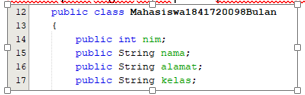

# Laporan Praktikum #2 - Class dan Object

## Kompetensi

- Mahasiswa dapat memahami deskripsi dari class dan object
- Mahasiswa dapat memahami implementasi dari proses instansiasi

## Ringkasan Materi

 Secara singkat class adalah abstraksi dari sebuah object (nyata ataupun tidak nyata) (roger s pressman). Apabila kita ingin membuat class mahasiswa, maka kita perlu melakukan abstraksi (mengindikasi bagian – bagian penting yang merepresentasikan benda itu sendiri) dari object mahasiswa itu sendiri. 

## Percobaan

### Percobaan 1

Studi Kasus 1: Dalam suatu perusahaan salah satu data yang diolah adalah data karyawan. Setiap karyawan memiliki id, nama, jenis kelamin, jabatan, jabatan, dan gaji. Setiap mahasiswa juga bisa menampilkan data diri pribadi dan melihat gajinya. 
 

1.	Gambarkan desain class diagram dari studi kasus 1!, 

2.	Sebutkan Class apa saja yang bisa dibuat dari studi kasus 1!,

- Class Karyawan1841720098

- Class TestKaryawan1841720098

3.	Sebutkan atribut beserta tipe datanya yang dapat diidentifikasi dari masing-masing class dari studi kasus 1! 

Atribut dan tipe data :
- idKaryawan : in
- namaKaryawan : String
- jenisKelamin : String
- Jabatan : String
- Gaji : int

4.	Sebutkan method-method yang sudah anda buat dari masing-masing class pada studi kasus 1!
- tampilDataBulan();

### Percobaan 2
Studi Kasus 2: Perhatikan class diagram dibawah ini. Buatlah program berdasarkan class diagram tersebut! 

Link Kode Program : [Mahasiswa1841720098Bulan](../../src/2_Class_dan_Object/Mahasiswa1841720098Bulan.java)

Link Kode Program : [TestMahasiswa1841720098Bulan](../../src/2_Class_dan_Object/TestMahasiswa1841720098Bulan.java)

1.	Jelaskan pada bagian mana proses pendeklarasian atribut pada program diatas!
 
 2.	Jelaskan pada bagian mana proses pendeklarasian method pada program diatas!
  
  3.	Berapa banyak objek yang di instansiasi pada program diatas! 
  
  4.	Apakah yang sebenarnya dilakukan pada sintaks program “mhs1.nim=101” ? 
-       Untuk mengisikan data pada atribut nim
5.	Apakah yang sebenarnya dilakukan pada sintaks program “mhs1.tampilBiodata()” ? 
-       Method yang di gunakan untuk menampilkan hasil biodata mahasiswa

6.	Instansiasi 2 objek lagi pada program diatas!
 

## Percobaan 3

Link Kode Program : [Barang1841720098Bulan](../../src/2_Class_dan_Object/Barang1841720098Bulan.java)

Link Kode Program : [TestBarang1841720098Bulan](../../src/2_Class_dan_Object/TestBarang1841720098Bulan.java)

1.	Apakah fungsi argumen dalam suatu method?
Memberikan nilai yang harus di eksekusi dalam method
2.	Ambil kesimpulan tentang kegunaan dari kata kunci return , dan kapan suatu method harus memiliki return!
Return digunakan untuk tipe data int karena untuk mengembalikan nilai int

## Tugas

Link Kode Program : [VideoGame1841720098Bulan](../../src/2_Class_dan_Object/VideoGame1841720098Bulan.java)

Link Kode Program : [TestVideoGame841720098Bulan](../../src/2_Class_dan_Object/TestVideoGame1841720098Bulan.java)

Link Kode Program : [Lingkaran1841720098Bulan](../../src/2_Class_dan_Object/Lingkaran1841720098Bulan.java)

Link Kode Program : [TestLingkaran1841720098Bulan](../../src/2_Class_dan_Object/TestLingkaran1841720098Bulan.java)

Link Kode Program : [Barang1841720098Bulann](../../src/2_Class_dan_Object/Barang1841720098Bulann.java)

Link Kode Program : [TestBarang1841720098Bulan](../../src/2_Class_dan_Object/TestBarang1841720098Bulann.java)

## Kesimpulan

- Pada jobsheet 2, kami diajarkan untuk mempelajari class dan object secara lebih terperinci dan melatih untuk menulis sytax yang rapi dan mudah dibaca.  

## Pernyataan Diri

Saya menyatakan isi tugas, kode program, dan laporan praktikum ini dibuat oleh saya sendiri. Saya tidak melakukan plagiasi, kecurangan, menyalin/menggandakan milik orang lain.

Jika saya melakukan plagiasi, kecurangan, atau melanggar hak kekayaan intelektual, saya siap untuk mendapat sanksi atau hukuman sesuai peraturan perundang-undangan yang berlaku.

Ttd,

***Defika Bulan Rahmaningrum***
