# Laporan Praktikum #3 - Enkapsulasi

## Kompetensi

- Memahami konsep Enkapsulasi dalam Pemrograman Beeorientasi Objek
- Mahasiswa dapat memahami konsep konstruktor dan kegunaan nya
- Mahasiswa dapat memahami konsep modifier

## Ringkasan Materi
Enkapsulasi adalah salah satu metode dalam PBO dimana user tidak perlu mengetahui alur kerja dari class tersebut. Contoh objek misalnya mesin penghisap debu (vacum cleaner), ketika kita mencolokkan kabel vacum cleaner dan menyalakan sakelarnya maka mesin tersebut siap digunakan untuk menghisap debu. Dalam proses tersebut kita tidak mengetahui proses rumit yang terjadi ketika mengubah listrik menjadi tenaga dari vacum cleaner. 
  

## Percobaan

### Percobaan 1
 
Percobaan 1 - Enkapsulasi 

Didalam percobaan enkapsulasi, buatlah class Motor yang memiliki atribut kecepatan dan kontakOn, dan memiliki method printStatus() untuk menampilkan status motor.

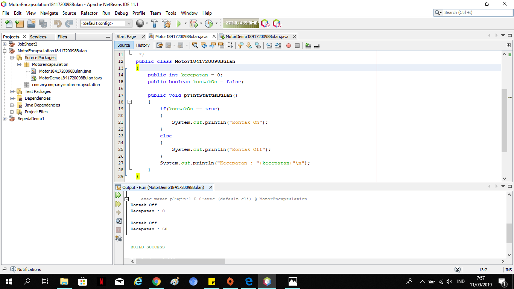
Link Kode Program : [Motor1841720098Bulan](../../src/3_Enkapsulasi/Motor1841720098Bulan.java)

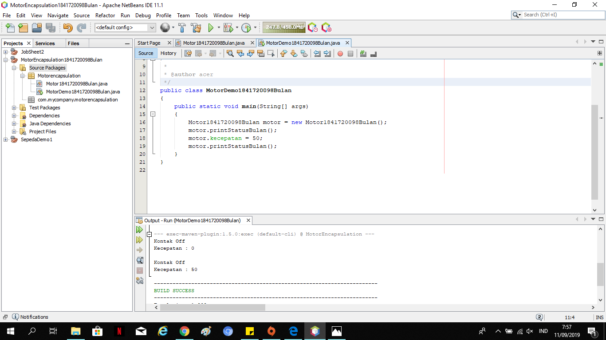
Link Kode Program : [MotorDemo1841720098Bulan](../../src/3_Enkapsulasi/MotorDemo1841720098Bulan.java)

### Percobaan 2
Percobaan 2 - Access Modifier 
Pada percobaan ini akan digunakan access modifier untuk memperbaiki cara kerja class Motor pada percobaan ke-1. 

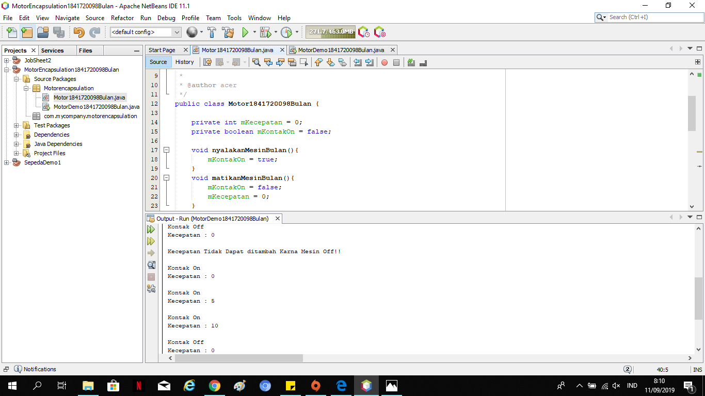
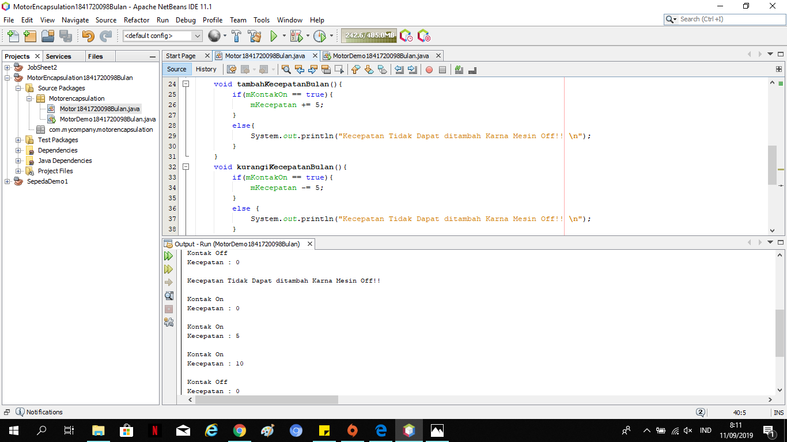
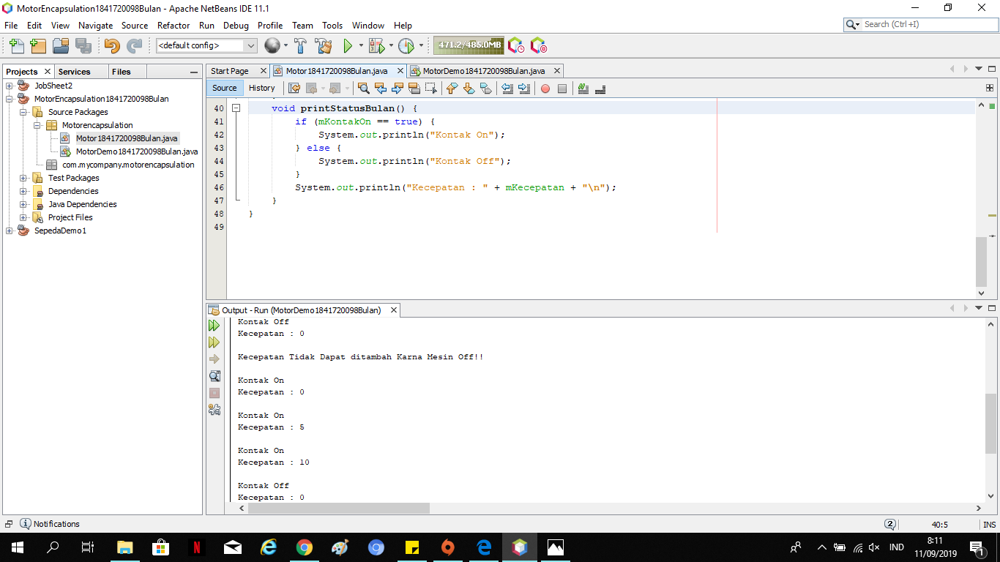

Link Kode Program : [Motor1841720098Bulan](../../src/3_Enkapsulasi/Motor1841720098Bulan.java)

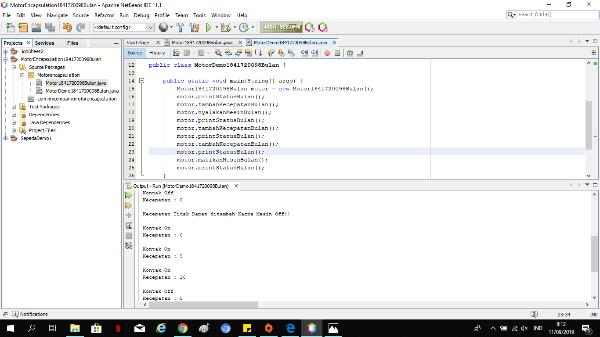
Link Kode Program : [MotorDemo1841720098Bulan](../../src/3_Enkapsulasi/MotorDemo1841720098Bulan.java)

### Pertanyaan 
1. Pada class MotorDemo, saat kita menambah kecepatan untuk pertama kalinya, mengapa muncul peringatan “Kecepatan tidak bisa bertambah karena Mesin Off!”?  

    Jawab : karena belum di panggilnya method kontak on sehingga output akan mengeluarkan peringatan bahwa motor masih dalam keadaan off
2. Mengapat atribut kecepatan dan kontakOn diset private? 

    Jawab : untuk menyembunyikan atribut dari class lain agar pemanggilan nya dapat terkontrol melalui method yang memanggil atribute tersebut.
3. Ubah class Motor sehingga kecepatan maksimalnya adalah 100!

    Jawab : 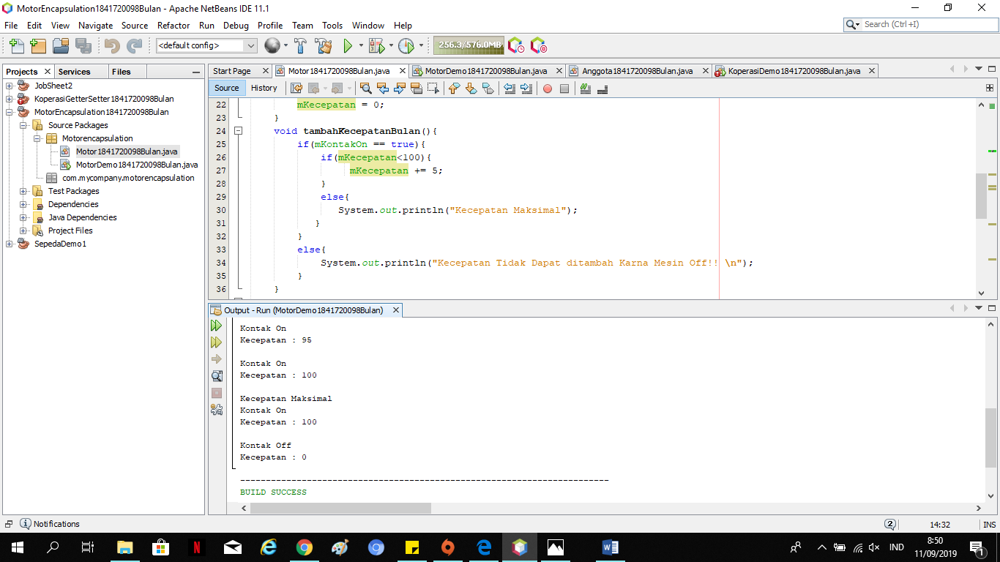

## Percobaan 3
Percobaan 3 -  Getter dan Setter 

Misalkan di sebuah sistem informasi koperasi, terdapat class Anggota. Anggota memiliki atribut nama, alamat dan simpanan, dan method setter, getter dan setor dan pinjam. Semua atribut pada anggota tidak boleh diubah sembarangan, melainkan hanya dapat diubah melalui method setter, getter, setor dan tarik. Khusus untuk atribut simpanan tidak terdapat setter karena simpanan akan bertambah ketika melakukan transaksi setor dan akan berkurang ketika melakukan peminjaman/tarik. 

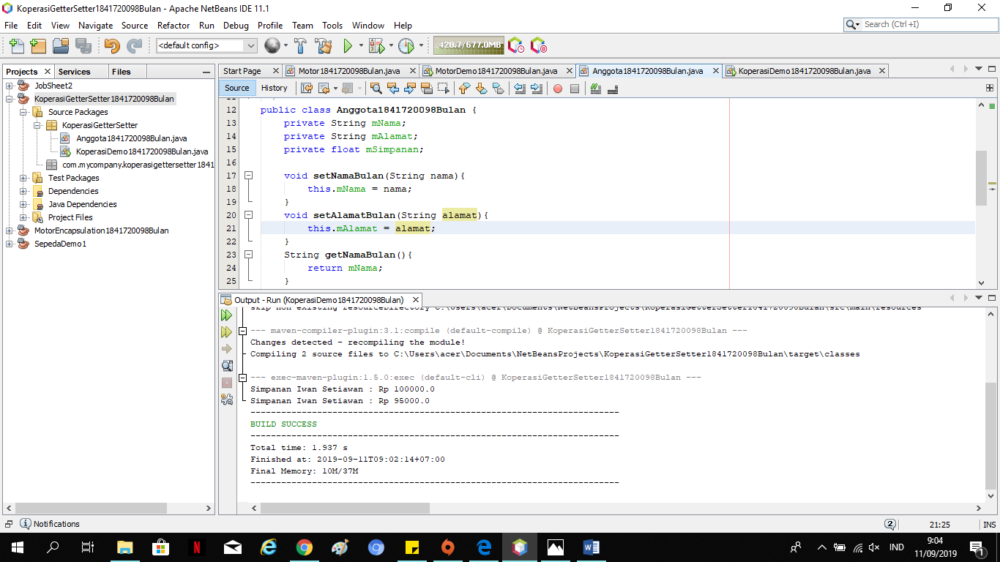
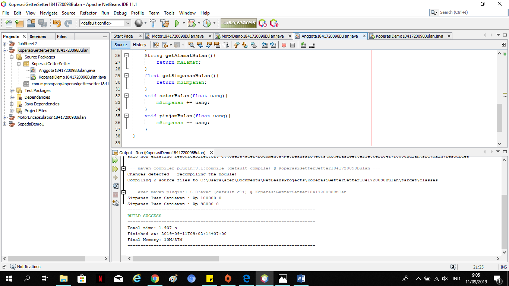
Link Kode Program : [Anggota1841720098Bulan](../../src/3_Enkapsulasi/Anggota1841720098Bulan.java)

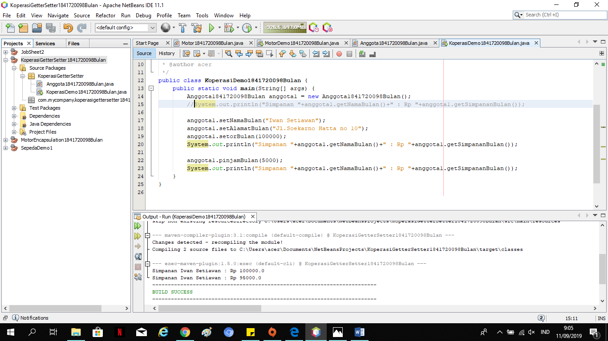
Link Kode Program : [KoperasiDemo1841720098Bulan](../../src/3_Enkapsulasi/KoperasiDemo1841720098Bulan.java)

## Percobaan 4
Percobaan 4 -  Konstruktor, Instansiasi 
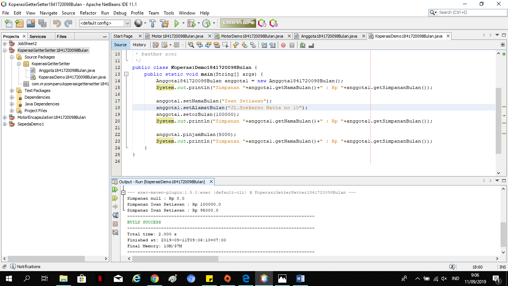
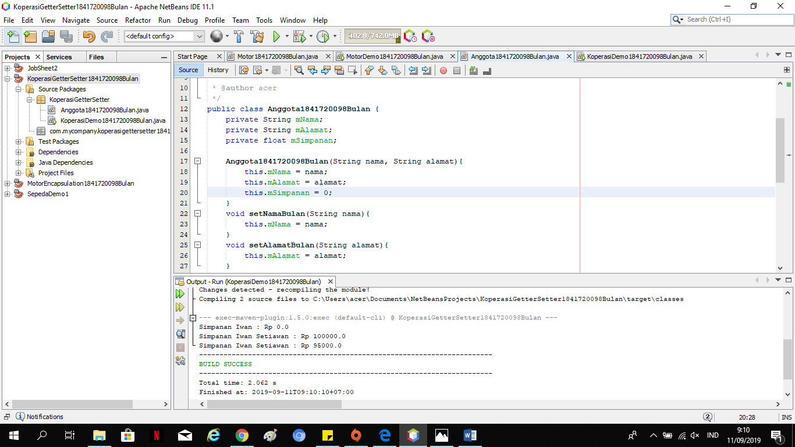
Link Kode Program : [Anggota1841720098Bulan](../../src/3_Enkapsulasi/Anggota1841720098Bulan.java)

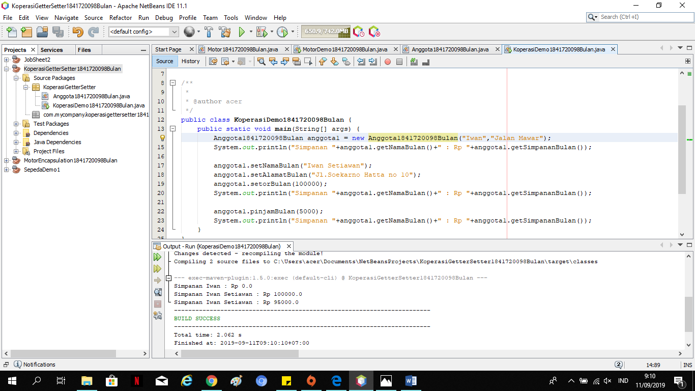
Link Kode Program : [KoperasiDemo1841720098Bulan](../../src/3_Enkapsulasi/KoperasiDemo1841720098Bulan.java)

## Pertanyaan – Percobaan 3 dan 4 
1. Apa yang dimaksud getter dan setter?
    
    Jawab : Getter adalah public method dan memiliki tipe data return, yang berfungsi untuk mendapatkan nilai dari atribut private. Sedangkan setter adalah public method yang tidak memliki tipe data return, yang berfungsi untuk memanipulasi nilai dari atribut private.
2. Apa kegunaan dari method getSimpanan()? 

    Jawab : untuk menyimpan data berapa yang disetorkan atau dipinjam 
3. Method apa yang digunakan untk menambah saldo?

    Jawab : method setorBulan()

4. Apa yand dimaksud konstruktor? 
    Jawab : method yang memiliki nama yang sama dengan class yang digunakan
5. Sebutkan aturan dalam membuat konstruktor? 

    Jawab :
      
- Nama konstruktor harus sama dengan nama class
- Konstruktor tidak memiliki tipe data return
- Konstruktor tidak boleh menggunakan modifier abstract, static, final, dan synchronized

6. Apakah boleh konstruktor bertipe private? 

    Jawab : Tidak, bila private maka objek tidak bisa diakes atau tidak bisa di instansiasi oleh class lain

7. Kapan menggunakan parameter dengan passsing parameter? 

    Jawab : Bila kita menggunakan konstruktor maka sebaiknya kita menggunakan passing parameter dan juga sebaliknya.

8. Apa perbedaan atribut class dan instansiasi atribut? 

    Jawab : Class merupakan brueprint prototype dari objek, kalau instansiasi digunakan untuk memanggil sebuah objek dari class yang lain.
9. Apa perbedaan class method dan instansiasi method?

    Jawab : Method merupakan suatu operasi berupa fungsi-fungsi yang dapat dikerjakan oleh suatu object.

## Tugas

[Tugas 1]
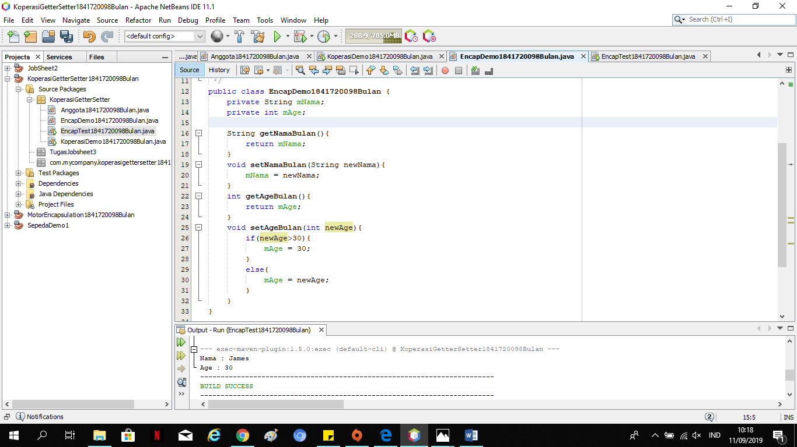
Link Kode Program : [EncapDemo1841720098Bulan](../../src/3_Enkapsulasi/EncapDemo1841720098Bulan.java)

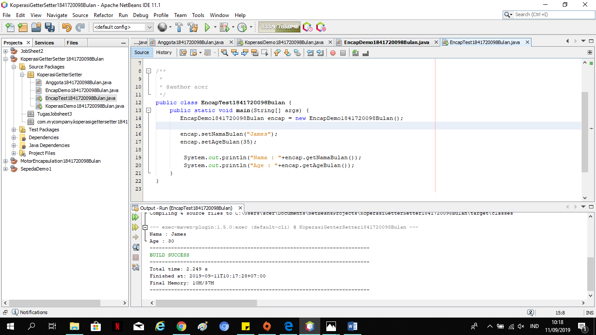
Link Kode Program : [EncapTest1841720098Bulan](../../src/3_Enkapsulasi/EncapTest1841720098Bulan.java)

[Tugas 2]

Pada program diatas, pada class EncapTest kita mengeset age dengan nilai 35, namun pada saat ditampilkan ke layar nilainya 30, jelaskan mengapa.

Jawab : karena telah di set agar umur yg lebih dari 30 di output kan menjadi umur 30

[Tugas 3]
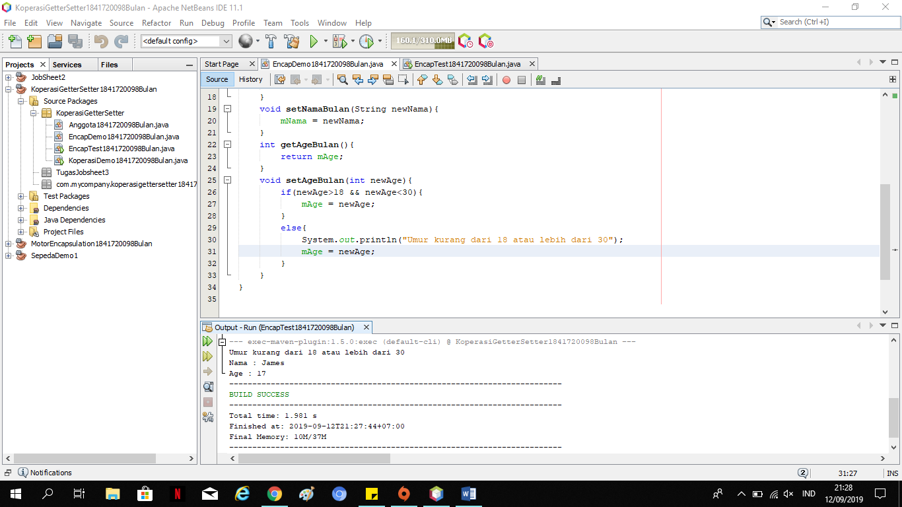
Link Kode Program : [EncapTest1841720098Bulan](../../src/3_Enkapsulasi/EncapTest1841720098Bulan.java)

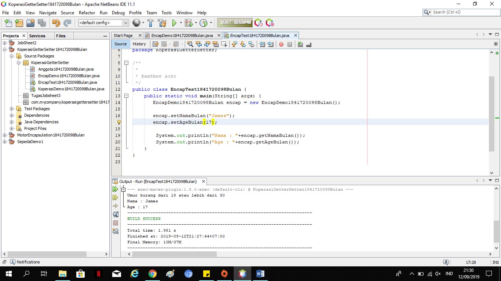
Link Kode Program : [EncapTest1841720098Bulan](../../src/3_Enkapsulasi/EncapDemo1841720098Bulan.java)

[Tugas 4]
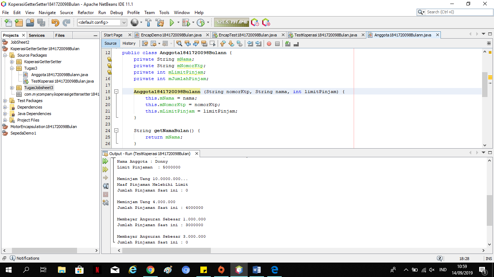
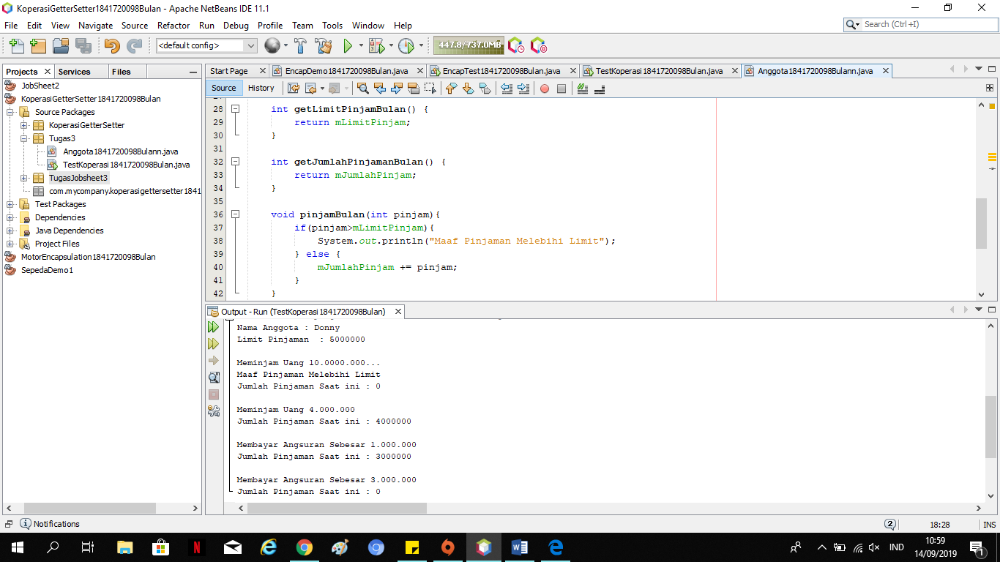
Link Kode Program : [Anggota1841720098Bulan](../../src/3_Enkapsulasi/Anggota1841720098Bulann.java)

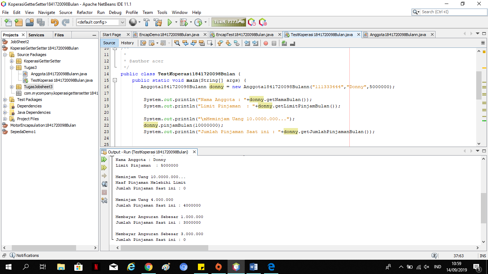
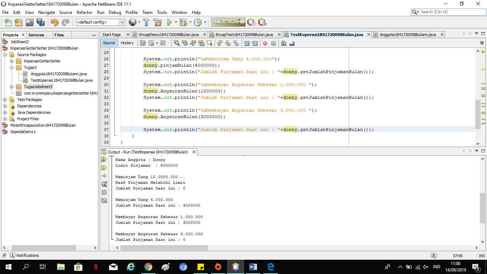
Link Kode Program : [TestKoperasi1841720098Bulan](../../src/3_Enkapsulasi/TestKoperasi1841720098Bulann.java)

[Tugas 5]
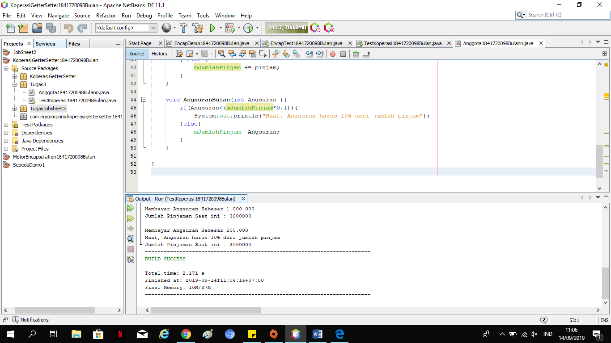
Link Kode Program : [Anggota1841720098Bulan](../../src/3_Enkapsulasi/Anggota1841720098Bulann.java)

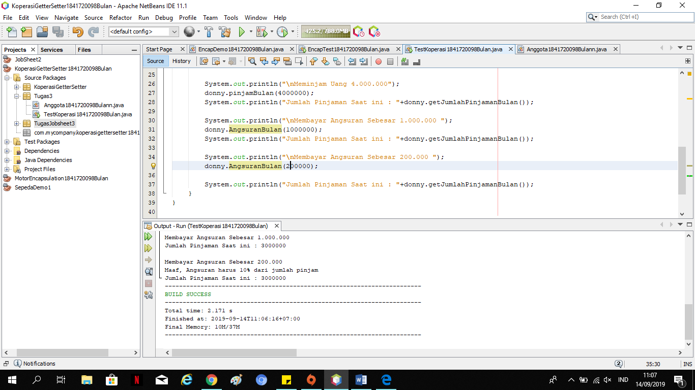
Link Kode Program : [TestKoperasi1841720098Bulan](../../src/3_Enkapsulasi/TestKoperasi1841720098Bulann.java)

[Tugas 6]
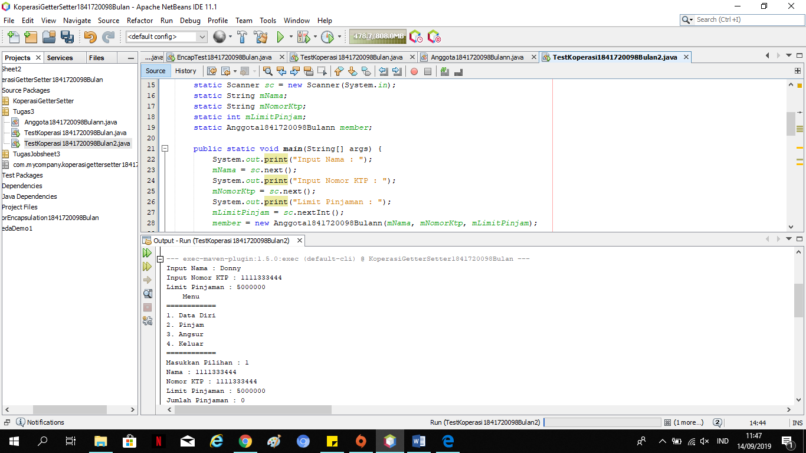
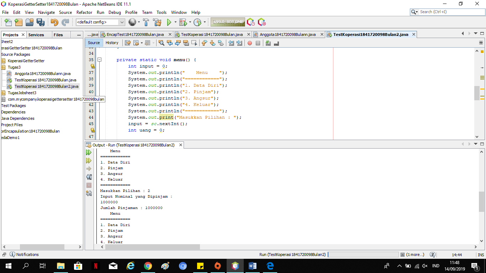
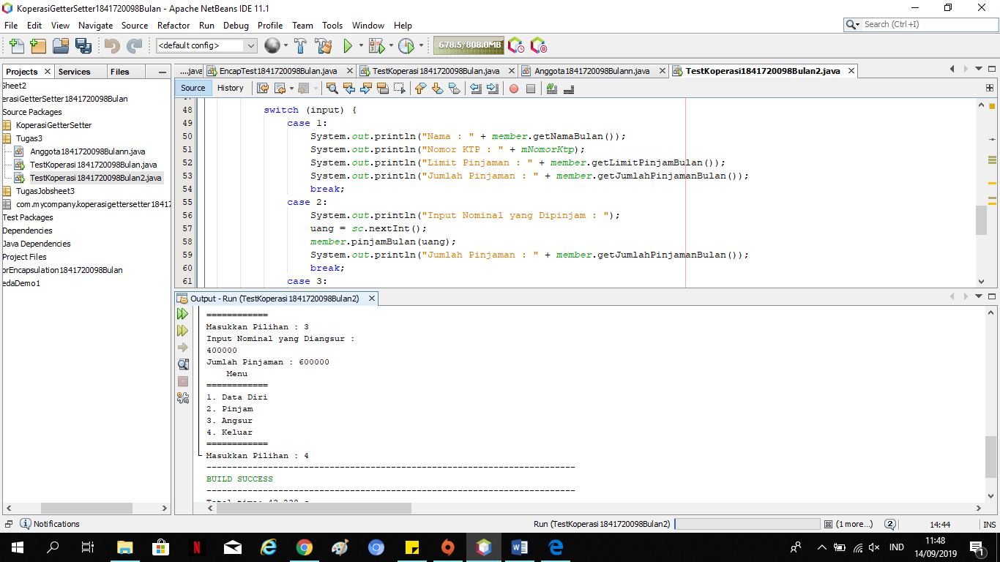

Link Kode Program : [TestKoperasi1841720098Bulan2](../../src/3_Enkapsulasi/TestKoperasi1841720098Bulan2.java)

## Kesimpulan

- Pada jobsheet 3, kami diajarkan untuk mempelajari konsep Enkapsulasi secara lebih terperinci dan mengetahui komponen-komponen yang baru

## Pernyataan Diri

Saya menyatakan isi tugas, kode program, dan laporan praktikum ini dibuat oleh saya sendiri. Saya tidak melakukan plagiasi, kecurangan, menyalin/menggandakan milik orang lain.

Jika saya melakukan plagiasi, kecurangan, atau melanggar hak kekayaan intelektual, saya siap untuk mendapat sanksi atau hukuman sesuai peraturan perundang-undangan yang berlaku.

Ttd,

***Defika Bulan Rahmaningrum***
