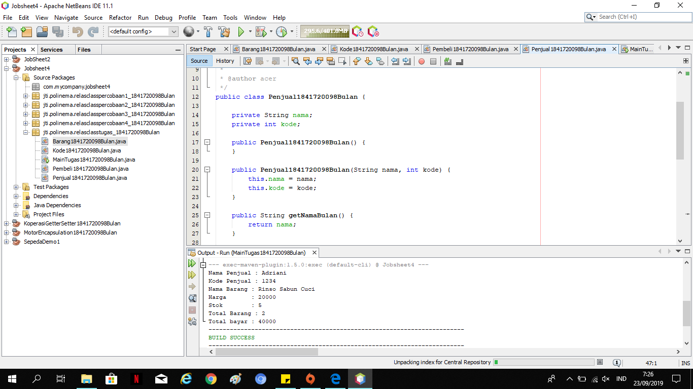
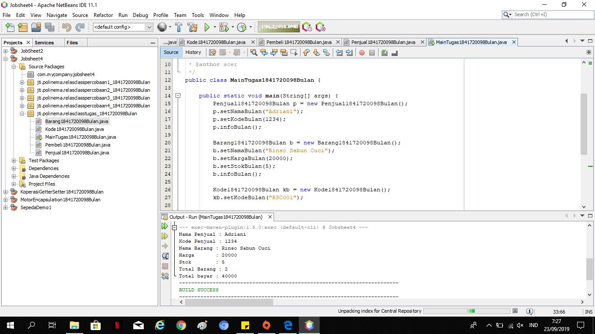

# Laporan Praktikum #4 - Relasi Class

## Kompetensi

1. Mahasiswa Mampu Memahami konsep relasi kelas
2. Mahasiswa Mampu Mengimplementasikan relasi has‑a dalam program

## Ringkasan Materi

Dalam Pemrograman Berorientasi Objek, sebuah aplikasi dibangun dengan menggabungkan beberapa kelas. Kelas-kelas tersebut saling bekerjasama untuk menyelesaikan suatu masalah.

 Dalam aplikasi yang berukuran yang cukup kompleks, banyak kelas-kelas yang terlibat dalam aplikasi tersebut. Maka untuk aplikasi yang kompleks tersebut dibutuhkan pemodelan kelas untuk menggambarkan aplikasi yang dibangun.

## Percobaan

### Percobaan 1

(pada percobaan ini, kita mendemonstrasikan bagaimana membuat relasi class yang sedehana)

Link Kode Program : [Processor1841720098Bulan](../../src/4_Relasi_Class/Processor1841720098Bulan.java)

Link Kode Program : [Laptop1841720098Bulan](../../src/4_Relasi_Class/Laptop1841720098Bulan.java)

Link Kode Program : [MainPercobaan11841720098Bulan](../../src/4_Relasi_Class/MainPercobaan1841720098Bulan.java)

### Pertanyaan 1
1. Di dalam class Processor dan class Laptop , terdapat method setter dan getter untuk
masing‑masing atributnya. Apakah gunanya method setter dan getter tersebut ?

        jawab : Getter berfungsi untuk mendapatkan nilai dari atribut private. setter berfungsi untuk memanipulasi nilai dari atribut private

2. Di dalam class Processor dan class Laptop, masing‑masing terdapat konstruktor
default dan konstruktor berparameter. Bagaimanakah beda penggunaan dari kedua jenis
konstruktor tersebut ?
       
        jawab : 
        - Defult konstruktor : tidak memiliki parameter, program akan di panggil secara langsung apabila programmer tidak membuat konstruktor.

        - Parameter konstruktor : memiliki lebih dari satu atau banyak konstruktor, konstruktor yang dibuat oleh programmer yang memiliki satu atau lebih parameter yang di inisial.

3. Perhatikan class Laptop, di antara 2 atribut yang dimiliki (merk dan proc), atribut
manakah yang bertipe object ?

        jawab : proc

4. Perhatikan class Laptop, pada baris manakah yang menunjukan bahwa class Laptop
memiliki relasi dengan class Processor ?

        jawab : pada baris dimana class processor dipanggil

5. Perhatikan pada class Laptop , Apakah guna dari sintaks proc.info() ?

        Jawab : untung memanggil merk proseccor dan cache memori dari class processor

6. Pada class MainPercobaan1, terdapat baris kode:
Laptop l = new Laptop("Thinkpad", p);.
Apakah p tersebut ?

        Jawab : hasil instansiasi dari class proseccor

Dan apakah yang terjadi jika baris kode tersebut diubah menjadi:
Laptop l = new Laptop("Thinkpad", new Processor("Intel i5",
3));

Bagaimanakah hasil program saat dijalankan, apakah ada perubahan ?

        Jawab : Tidak terjadi perubahan, karna p adalah intansiasi dari processor sehingga ketika diganti menjadi Laptop l = new Laptop("Thinkpad", new Processor("Intel i5",3)); hal ini hanya menjabarkan proseccor tersebut

### Percobaan 2

(Pada percobaan 2 diagram class yang menggambarkan sistem rental mobil. Pelanggan bisa menyewa mobil sekaligus sopir. Biaya sopir dan biaya sewa mobil dihitung per hari.  )

Link Kode Program : [Mobil1841720098Bulan](../../src/4_Relasi_Class/Mobil1841720098Bulan.java)

Link Kode Program : [Sopir1841720098Bulan](../../src/4_Relasi_Class/Sopir1841720098Bulan.java)

Link Kode Program : [Pelanggan1841720098Bulan](../../src/4_Relasi_Class/Pelanggan1841720098Bulan.java)

Link Kode Program : [MainPercobaan21841720098Bulan](../../src/4_Relasi_Class/MainPercobaan21841720098Bulan.java)

### Pertanyaan 2
1.	Perhatikan class Pelanggan. Pada baris program manakah yang menunjukan bahwa class Pelanggan memiliki relasi dengan class Mobil dan class Sopir ? 

        Jawab : pada penulisan parameter dari class pelanggan

2.	Perhatikan method hitungBiayaSopir pada class Sopir, serta method hitungBiayaMobil pada class Mobil. Mengapa menurut Anda method tersebut harus memiliki argument hari ?

        Jawab : untuk menghitung harga mobil dan sopir yang disewa perhari

3.	Perhatikan kode dari class Pelanggan. Untuk apakah perintah mobil.hitungBiayaMobil(hari) dan sopir.hitungBiayaSopir(hari) ? 

        Jawab : untuk menghitung biaya keseluruhan yang harus dibayar oleh si pelanggan

4.	Perhatikan class MainPercobaan2. Untuk apakah sintaks p.setMobil(m) dan p.setSopir(s) ? 

        Jawab : untuk memanggil class mobil dan sopir yang telah di instansiasi menjadi s dan m

5.	Perhatikan class MainPercobaan2. Untuk apakah proses p.hitungBiayaTotal() tersebut ? 

        Jawab : menghitung jumlah sewa mobil dan sopir berdasarkan banyak hari dari pelanggan tersebut 

6.	Perhatikan class MainPercobaan2, coba tambahkan pada baris terakhir dari method main dan amati perubahan saat di‑run! 
System.out.println(p.getMobil().getMerk()); 
Jadi untuk apakah sintaks p.getMobil().getMerk() yang ada di dalam method main tersebut?

        Jawab : mengoutputkan merk mobil yang disewa oleh pelanggan

### Percobaan 3
(Pada percobaan‑percobaan sebelumnya, relasi dalam class dinyatakan dalam one‑to‑one. Tetapi ada kalanya relasi class melibatkan lebih dari satu. Hal ini disebut dengan multiplicity)

Link Kode Program : [Pegawai1841720098Bulan](../../src/4_Relasi_Class/Pegawai1841720098Bulan.java)

Link Kode Program : [KeretaApi1841720098Bulan](../../src/4_Relasi_Class/KeretaApi1841720098Bulan.java)

Link Kode Program : [MainPercobaan31841720098Bulan](../../src/4_Relasi_Class/MainPercobaan31841720098Bulan.java)

### Pertanyaan 3
1.	Di dalam method info() pada class KeretaApi, baris this.masinis.info() dan this.asisten.info() digunakan untuk apa ? 

Jawab : untuk menampilkan data masinis dan data asisten

2. Buatlah main program baru dengan nama class MainPertanyaan pada package yang sama. Tambahkan kode berikut pada method main() ! 

Pegawai masinis = new Pegawai("1234", "Spongebob Squarepants"); KeretaApi keretaApi = new KeretaApi("Gaya Baru", "Bisnis", masinis); 
System.out.println(keretaApi.info()); 

Apa hasil output dari main program tersebut ? Mengapa hal tersebut dapat terjadi ?

Jawab : 
 

terjadi eror, karane ada variabel yang tidak bernilai atau disebut dengan null, dan variabel tersebut adalah object asisten pada class KeretaApi1841720098Bulan

3. Perbaiki class KeretaApi sehingga program dapat berjalan ! 

Jawab : 

 

 
### Percobaan 4

Link Kode Program : [Penumpang1841720098Bulan](../../src/4_Relasi_Class/Penumpang1841720098Bulan.java)

Link Kode Program : [Kursi1841720098Bulan](../../src/4_Relasi_Class/Kursi1841720098Bulan.java)

Link Kode Program : [Gerbong1841720098Bulan](../../src/4_Relasi_Class/Gerbong1841720098Bulan.java)

### Pertanyaan 4
1.	Pada main program dalam class MainPercobaan4, berapakah jumlah kursi dalam Gerbong A ? 

Jawab : 10 kursi

2.	Perhatikan potongan kode pada method info() dalam class Kursi. Apa maksud kode tersebut ? 

...
 	if (this.penumpang != null) {
 	info += "Penumpang: " + penumpang.info() + "\n";
 	} 
... 

Jawab : digunakan untuk menampilkan kursi yang terisi oleh penumpang, tetapi bila penumpang tidak bernilai atau null, maka kode program yang terdapat pada if tidak dijalankan atau berarti kursi tersebut masih kosong

3.	Mengapa pada method setPenumpang() dalam class Gerbong, nilai nomor dikurangi dengan angka 1 ?

Jawab : karena index array selalu dimulai dari 0, oleh karena itu nilai nomer harus dikurangi 1 agar array di index 0 atau di index pertama dapat terisi

4.	Instansiasi objek baru budi dengan tipe Penumpang, kemudian masukkan objek baru tersebut pada gerbong dengan gerbong.setPenumpang(budi, 1). Apakah yang terjadi ?

Jawab : 

 

5.	Modifikasi program sehingga tidak diperkenankan untuk menduduki kursi yang sudah ada penumpang lain !

Jawab : 
 

## Tugas

(Buatlah sebuah studi kasus, rancang dengan class diagram, kemudian implementasikan ke dalam program! Studi kasus harus mewakili relasi class dari percobaan‑percobaan yang telah dilakukan pada materi ini, setidaknya melibatkan minimal 4 class (class yang berisi main tidak dihitung). )

Link Kode Program : [Barang1841720098Bulan](../../src/4_Relasi_Class/Barang1841720098Bulan.java)

Link Kode Program : [Kode1841720098Bulan](../../src/4_Relasi_Class/Kode1841720098Bulan.java)

Link Kode Program : [Pembeli1841720098Bulan](../../src/4_Relasi_Class/Pembeli1841720098Bulan.java)

Link Kode Program : [Penjual1841720098Bulan](../../src/4_Relasi_Class/Penjual1841720098Bulan.java)

Link Kode Program : [MainTugas1841720098Bulan](../../src/4_Relasi_Class/MainTugas1841720098Bulan.java)

## Kesimpulan

- Pada jobsheet 4, kami diajarkan untuk membuat program yang merelasikan antar class yang ada.  

## Pernyataan Diri

Saya menyatakan isi tugas, kode program, dan laporan praktikum ini dibuat oleh saya sendiri. Saya tidak melakukan plagiasi, kecurangan, menyalin/menggandakan milik orang lain.

Jika saya melakukan plagiasi, kecurangan, atau melanggar hak kekayaan intelektual, saya siap untuk mendapat sanksi atau hukuman sesuai peraturan perundang-undangan yang berlaku.

Ttd,

***Defika Bulan Rahmaningrum***
